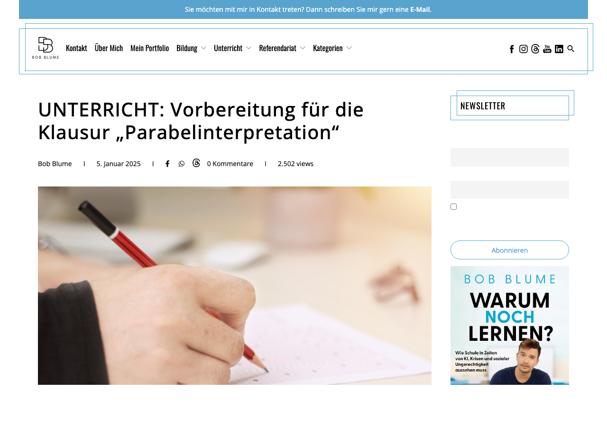
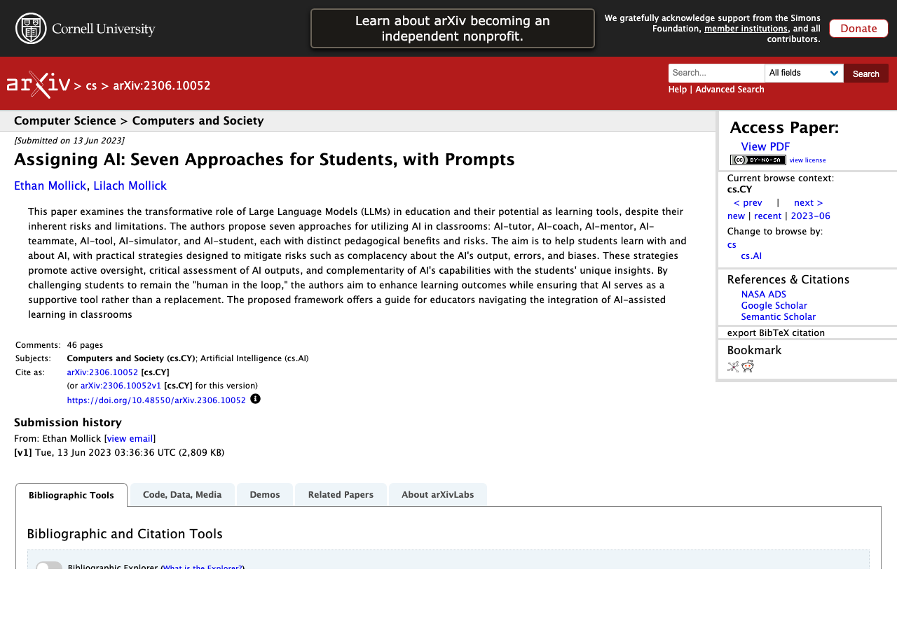
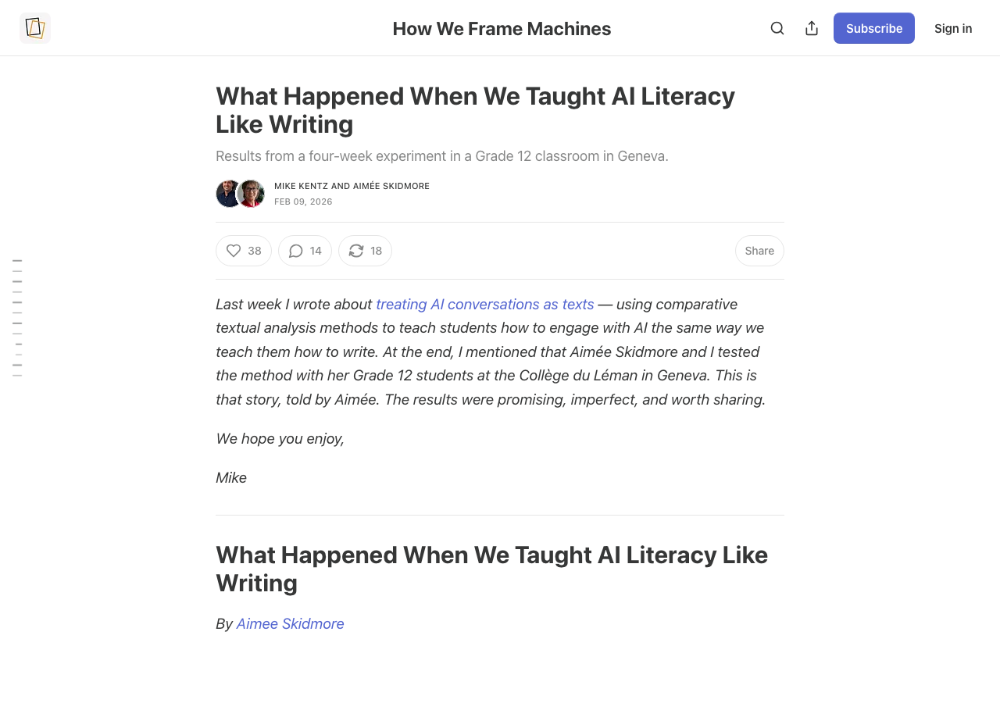
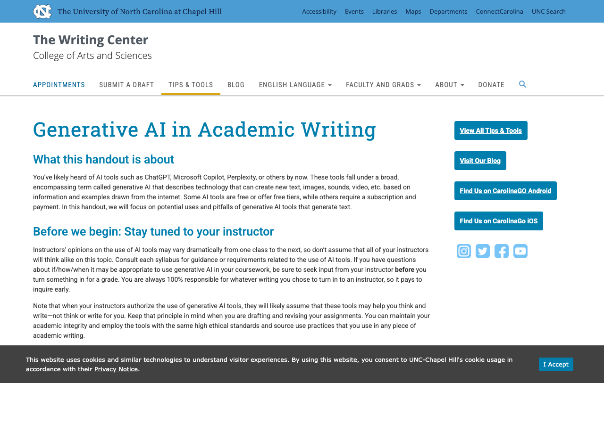
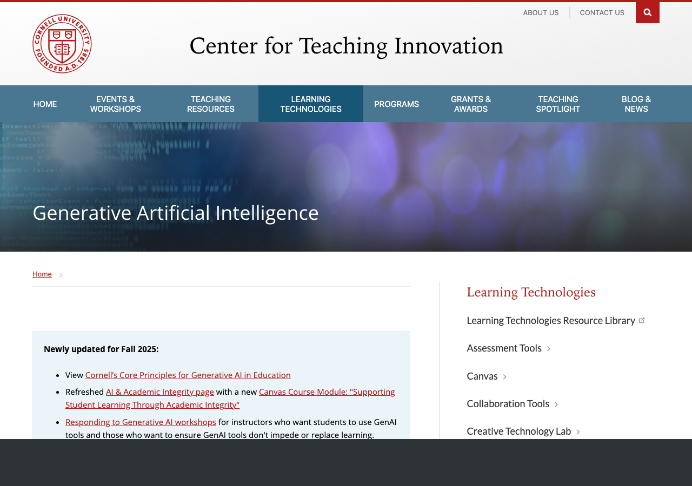
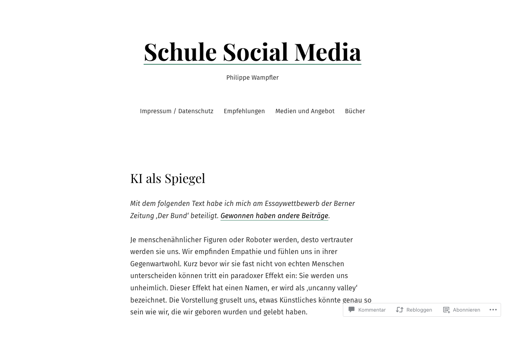
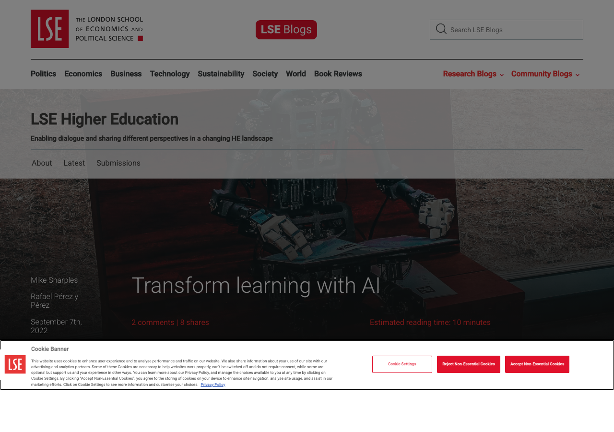
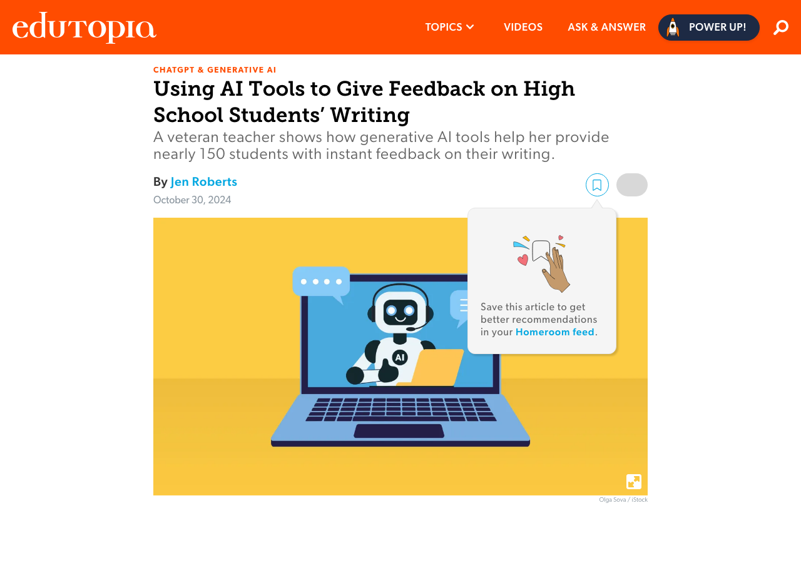
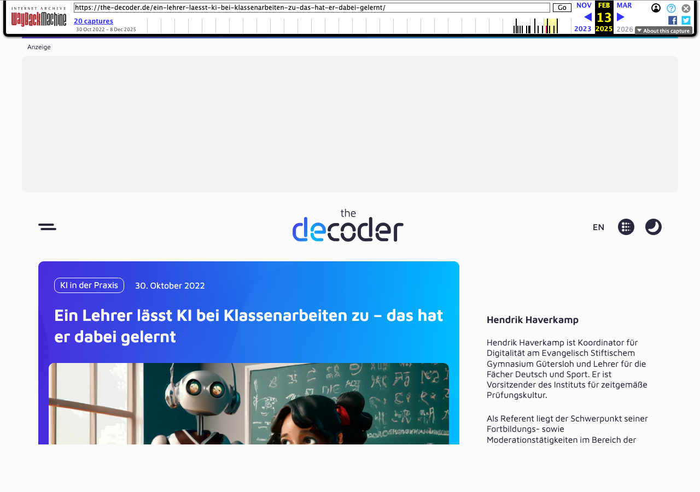
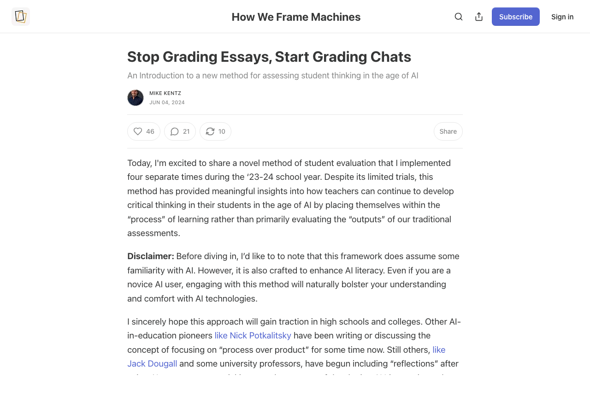

## {.artwork-slide background-color="#0a0a0f" visibility="uncounted"}

SYSTEM 1 · intuitiv, schnell

GEFAHR
WÄRME
HUNGER
HALT
JA
NEIN
ANGST
SCHÖN
FALSCH
SCHNELL
WAHR
LICHT
DURST
GRAU
WEH
HELL
KLIRR
WEG

SYSTEM 2 · deliberativ, langsam

Ich
überlege
mit
Absicht
▊

SYSTEM 3 · ausserhalb des Gehirns

ARTIFICIAL

COGNITION

<code>&lt;thinking/&gt;</code>

KOGNITIVE KAPITULATION

Wharton · Preregistered · 3 Experimente

Kognitive
Kapitulation.

1 372 Personen lösen Urteilsaufgaben — 
einmal allein, einmal mit KI-Vorschlag.

Ist der KI-Vorschlag richtig

+25%-Punkte

sind Menschen mit KI korrekter

Ist der KI-Vorschlag falsch

−15%-Punkte

sind Menschen mit KI schlechter

Die meisten übernehmen, <strong>ohne zu prüfen</strong>.

Shaw, S.&nbsp;D., &amp; Nave, G. (2026). <em>Thinking—Fast, Slow, and Artificial: How AI is Reshaping Human Reasoning and the Rise of Cognitive Surrender</em>. Wharton · 9 593 Trials · SSRN 6097646

## Drei Fragen

<ol style="margin-top: 1.2em; font-size: 1.05em; line-height: 1.65;">
<li><strong>Welche Forschungsevidenz</strong> ist für den Schreibunterricht handlungsleitend?</li>
<li><strong>Wie kombinieren</strong> erfahrene Lehrpersonen und Hochschuldozierende analoge und KI-gestützte Arbeit <strong>konkret</strong>?</li>
<li><strong>Welche Entscheidungen</strong> muss man vor dem Einsatz von KI treffen?</li>
</ol>

Erhebung im Plenum

Wer nutzt generative KI bereits in einer Schreibaufgabe mit Lernenden? <strong>Abstufung 0–3 per Handzeichen</strong>.

Auf diese drei Fragen kommen wir am Ende zurück.

## Vier Phasen

<h3 style="color: #7a00df; margin-top: 0; font-size: 1.15em;">1 · Planen</h3>

Ideen finden, Thema klären, Material sammeln

<h3 style="color: #7a00df; margin-top: 0; font-size: 1.15em;">2 · Strukturieren</h3>

Ordnen, Gliederung entwickeln

<h3 style="color: #e30059; margin-top: 0; font-size: 1.15em;">3 · Formulieren</h3>

Entwerfen, Sätze bauen

<h3 style="color: #e30059; margin-top: 0; font-size: 1.15em;">4 · Überarbeiten</h3>

Prüfen, überdenken, Feinschliff

Schreiben verläuft nicht linear: Jede Phase kann jederzeit zu einer früheren zurückspringen · Modell nach Hayes &amp; Flower (1980), für KI-Kontexte aktualisiert bei Schneegaß (2025)

→ Eigenständige Konzeptarbeit → KI-Input → begründete Entscheidung

## Analog zuerst

Befund 1 · Nutzungsmuster

Lernende setzen generative KI <strong>am intensivsten in der Planungsphase</strong> ein — deutlich seltener beim Überarbeiten. Gerade die Phase, in der KI wertvoll wäre (Distanznahme, Alternativsuche), wird kaum genutzt.

<a href="https://doi.org/10.1016/j.jslw.2025.101230" target="_blank">Hwang, H., Chang, X., &amp; Sun, J. (2025)</a>, <em>Journal of Second Language Writing, 69</em>, 101230.

Befund 2 · Preis für Qualitätsgewinn

KI-Unterstützung <strong>hebt die Textqualität messbar</strong> — senkt aber gleichzeitig <strong>Schreibmotivation und empfundene Autor:innenschaft</strong>. Wer die KI früh einsetzt, verliert den Text.

<a href="https://doi.org/10.1016/j.chbah.2025.100140" target="_blank">Mei, P. et al. (2025)</a>, <em>Computers in Human Behavior: Artificial Humans, 4</em>, 100140.

Ausnahmen: Recherche bei fehlendem Vorwissen · standardisierte Textsorten · produktive Blockaden.

## Phase 1 · Planen

1 · Analog · <a href="https://bobblume.de/2025/01/05/unterricht-vorbereitung-fuer-die-klausur-parabelinterpretation/" target="_blank">nach Bob Blume</a>

Strukturiertes Vorwissen zuerst

Drei Schritte vor jeder KI: Problem identifizieren · Gliederung skizzieren · eigene Frage formulieren.

Ich lasse die Schülerinnen und Schüler zuerst ihr eigenes Verständnis des Textes entwickeln — Problem, Gliederung, Frage — und erst danach kommt das Sprachmodell ins Spiel. Sonst wird die KI zur Krücke statt zum Werkzeug.

bobblume.de · 05.01.2025

→

2 · KI · <a href="https://arxiv.org/abs/2306.10052" target="_blank">nach Ethan Mollick</a>

KI als Tutor, nicht als Autor

"<em>Act as a tutor. Ask me 5 increasingly difficult questions. Do not give answers — only questions.</em>"

Assigning AI the role of tutor — rather than answer-giver — shifts the cognitive load back to the student. The prompt structure matters more than the model.

Mollick &amp; Mollick (2023) · Assigning AI, arXiv 2306.10052

→

3 · Analog · <a href="https://mikekentz.substack.com/p/what-happened-when-we-taught-ai-literacy" target="_blank">nach Mike Kentz</a>

Chat-Transkript annotieren

rot übernommen · lila verworfen · blau eigener Gedanke.

We had students mark every sentence of their ChatGPT transcript in three colors: what they adopted, what they rejected, what they added themselves. Suddenly the invisible decisions became visible.

mikekentz.substack.com · What happened when we taught AI literacy

<a href="https://xn--leserume-4za.de/wp-content/uploads/2025/06/Schneegass-2025-LR-JG12-H11.pdf" target="_blank">Schneegaß (2025)</a> · links: Schreibverlauf · rechts: KI-Einsatz (blaue Punkte = ChatGPT)

Schneegaß (2025) · Dokumentenportraits

Jede Spur = <strong>ein realer Schreibprozess eines Schülers / einer Schülerin</strong> über die Zeit. Die <strong>linke Seite</strong> zeigt den Schreibverlauf (Planen, Formulieren, Überarbeiten), die <strong>rechte Seite</strong> den KI-Einsatz — blaue Punkte markieren ChatGPT-Nutzung. Die Portraits zeigen: <strong>ChatGPT taucht vor allem früh im Prozess auf</strong> — und verschwindet, sobald formuliert wird.

<a href="https://xn--leserume-4za.de/wp-content/uploads/2025/06/Schneegass-2025-LR-JG12-H11.pdf" target="_blank">Schneegaß (2025)</a>, Leseräume 12(11).

## Phase 2 · Strukturieren

1 · Analog · <a href="https://writingcenter.unc.edu/tips-and-tools/generative-ai-in-academic-writing/" target="_blank">nach UNC Writing Center</a>

Argumente händisch gewichten

Post-its mit allen Argumenten — <strong>vor</strong> KI-Konsultation markieren: stark · mittel · schwach.

Before turning to a generative tool, list all of your arguments physically and weigh them against each other. The tool should help you organize, not decide, your priorities.

writingcenter.unc.edu · Generative AI in Academic Writing

→

2 · KI · <a href="https://teaching.cornell.edu/generative-artificial-intelligence" target="_blank">nach Cornell CTI</a>

Struktur-Varianten generieren

"<em>Outline this topic as (1) argumentative, (2) descriptive, (3) expository, (4) narrative essay. Compare how priority changes.</em>"

Have students request multiple structural variants of the same content from the model — argumentative, descriptive, expository, narrative. Comparing how emphasis shifts between versions is more instructive than accepting any single outline.

teaching.cornell.edu · Generative Artificial Intelligence

→

3 · Analog · <a href="https://xn--leserume-4za.de/wp-content/uploads/2025/06/Philipp-et-al-2025-LR-JG12-H11-1.pdf" target="_blank">nach Philipp et al., PHZH iArgue</a>

Divergent → konvergent

KI darf <strong>divergent</strong> sein — die <strong>konvergente</strong> Entscheidung verantwortet die Person schriftlich.

ChatGPT kann divergentes Denken anregen — die Verantwortung für die konvergente Auswahl und begründete Entscheidung bleibt schriftlich bei den Lernenden. Metareflexion wird Lernziel.

Philipp et al. (2025) · Leseräume 12(11) · iArgue, PHZH

<a href="https://xn--leserume-4za.de/wp-content/uploads/2025/06/Philipp-et-al-2025-LR-JG12-H11-1.pdf" target="_blank">Philipp et al. (2025)</a> · iArgue-Designprinzipien (PHZH)

<strong>iArgue-Kernbefunde</strong> für argumentatives Schreiben:
<ul style="margin-top: 0.3em;">
<li><strong>Divergentes Denken</strong> gezielt durch KI erweitern</li>
<li><strong>Konvergentes Denken</strong> in der Textredaktion vom Menschen</li>
<li><strong>Metareflexion</strong> über KI-Output als Lernziel</li>
</ul>

## Phase 3 · Formulieren

1 · Analog · <a href="https://schulesocialmedia.com/2024/03/25/ki-als-spiegel/" target="_blank">nach Philippe Wampfler</a>

Freies Schreiben zuerst

"<em>Erst wenn Sie wissen, was Sie sagen wollen, ist KI als Variationswerkzeug hilfreich.</em>"

Bevor KI zur Sprache kommt, müssen Schreibende wissen, was sie sagen wollen. Erst dann kann die Maschine als Spiegel dienen — sonst spiegelt sie nur sich selbst.

schulesocialmedia.com · KI als Spiegel (Philippe Wampfler)

→

2 · KI · <a href="https://blogs.lse.ac.uk/highereducation/2022/09/07/transforming-the-classroom-with-ai/" target="_blank">nach LSE (dokumentiert)</a>

Stil-Varianten + Reflexion

"<em>Suggest style improvements while keeping my argument. Then write a reflective paragraph comparing both versions.</em>"

Asking the model to improve style while preserving the argument, and then asking students to write a short reflection comparing the two versions, turns revision into metacognition.

blogs.lse.ac.uk · Transforming the Classroom with AI

→

3 · Analog · <a href="https://www.edutopia.org/article/ai-writing-feedback-students/" target="_blank">nach Jen Roberts</a>

Drei-Spalten-Bewertung

Jeden KI-Vorschlag in drei Spalten einordnen: <strong>Stärken</strong> · <strong>Schwächen</strong> · <strong>offene Fragen</strong>. Übernommen wird nur, was mindestens zwei Stärken aufweist.

My students evaluate every AI suggestion against three columns — Strengths, Areas of Growth, Wonderings. Only suggestions with at least two strengths make it into the revised draft.

edutopia.org · Jen Roberts · AI Writing Feedback

<a href="https://doi.org/10.21243/mi-01-25-26" target="_blank">Freinhofer et al. (2025)</a> · PCRR-Framework (PH Tirol)

<strong>PCRR</strong>: Plan — Create — Review — Reflect.

Ein pädagogischer Prompting-Rahmen, iterativ in drei Praxisfällen erprobt. Statt "einfach prompten" eine bewusste Phasen-Struktur, die auch Lernenden vermittelbar ist.

"Prompt Literacy ist ein eigenständiges Lernziel, nicht bloss eine Technik." — <a href="https://doi.org/10.1002/jaal.70020" target="_blank">Tour &amp; Zadorozhnyy (2025)</a>

## Phase 4 · Überarbeiten

1 · Peer · <a href="https://web.archive.org/web/2024/https://the-decoder.de/ein-lehrer-laesst-ki-bei-klassenarbeiten-zu-das-hat-er-dabei-gelernt/" target="_blank">nach Haverkamp</a>

Peer liest laut vor

"<em>Der Mund erkennt Brüche, die das Auge überliest.</em>" Stolperstellen rot markieren vor jeder KI-Nutzung.

Ich lasse die Texte in der Klasse laut vorlesen, bevor irgendein Modell drangeht. Der Mund erkennt Brüche, die das Auge überliest — und die KI glättet diese Brüche, ohne sie zu bemerken.

the-decoder.de · Hendrik Haverkamp · KI bei Klassenarbeiten

→

2 · KI · <a href="https://arxiv.org/abs/2306.10052" target="_blank">nach Mollick (Tutor-Rolle)</a>

Sokratische Fragen

"<em>Ask me 3 Socratic questions about my argument that I cannot easily answer. Do not correct — only question.</em>"

The AI-as-tutor pattern works in revision too: ask for hard questions, not corrections. The student's next draft comes from answering those questions — not from accepting suggestions.

Mollick &amp; Mollick (2023) · Assigning AI, arXiv 2306.10052

→

3 · Allein · <a href="https://mikekentz.substack.com/p/a-new-assessment-design-framework" target="_blank">nach Kentz</a>

Transkript-Annotation

Chat-Transkript wird nach Rubric bewertet. <em>Wo habe ich kapituliert?</em>

We no longer grade just the final product. We grade the chat transcript itself — marking where the student surrendered their thinking to the AI and where they pushed back. The transcript is the assignment.

mikekentz.substack.com · A New Assessment Design Framework

## Schreibszenarien

Prüfungsformat anpassen

Prompt-Protokoll als Leistungsbestandteil · mündliche Verteidigung nach Textabgabe · Gewichtung verschieben vom Produkt zum Prozess · Rückkehr zu Stift und Papier in manchen Fällen.

<a href="https://dlh.zh.ch/home/aktuell/708-leitfaeden-ki-projektarbeiten" target="_blank">DLH Kanton Zürich</a> · Falck &amp; Haverkamp (2025), <em>Pädagogik 77</em>(5).

Klassenregel explizit

KI-Einsatz <strong>pro Aufgabe</strong> spezifizieren (erlaubt / dokumentationspflichtig / untersagt). Lernende unterzeichnen die Klassenregel mit — Verantwortung entsteht durch Aushandlung.

Vorbild: <a href="https://www.lusem.lu.se/internal/support-and-resources/digital-tools/what-about-ai/" target="_blank">Lund University (LUSEM)</a> · Department-Policy mit Template.

Schweizer Berufsbildung

Die <a href="https://www.ict-berufsbildung.ch/projekte/digitalisierung/generative-ki-integration-in-der-berufsbildung" target="_blank">ICT-Berufsbildung Schweiz</a> dokumentiert seit 2025 Best-Practice-Beispiele — inklusive Textbausteinen für Reglemente und Prüfungsordnungen.

## Anwendungsphase · Fallarbeit

Paar- oder Dreier-Gruppen: Überarbeitung eines FaGe-Bewerbungstexts mit KI-Unterstützung

<strong>Ablauf (5 Minuten)</strong>
<ul style="margin-top: 0.4em; list-style: none; padding: 0;">
<li><strong>0:30</strong> Rezeption des Textes</li>
<li><strong>2:00</strong> Prompt formulieren und ausführen</li>
<li><strong>1:30</strong> Gruppenarbeit: Annehmen / Verwerfen mit Begründung</li>
<li><strong>1:00</strong> Plenum: eine zentrale Erkenntnis je Gruppe</li>
</ul>

Du bist meine kritische Leserin.  
Hier ist ein Text einer Lernenden für eine FaGe-Lehrstellenbewerbung: 
<strong>[TEXT EINFÜGEN]</strong>  
Gib mir: (1) drei Stellen, die <strong>nicht überzeugen</strong>. (2) eine Formulierungs-Alternative für den schwächsten Satz. (3) eine <strong>Frage</strong>, die ich der Lernenden stellen könnte.  
Bleibe konkret. <strong>Höchstens 120 Wörter.</strong> Korrigiere keine Fehler.

Schülertext "Mira Imhof" und Prompt-Vorlage auf dem Handout + QR-Code. <em>Der Text ist fiktiv — als realistisches Beispiel konstruiert, nicht von einer echten Lernenden.</em>

## Drei Antworten

1

Welche Forschungsevidenz ist handlungsleitend?

KI wirkt bei <strong>didaktischer Einbettung</strong> — aber mit messbarem Preis bei Kreativität, Diversität und kognitiver Eigenleistung.

2

Wie kombinieren Lehrpersonen konkret?

Immer im Muster <strong>analog → KI → analog</strong>. Die KI-Rolle wird bewusst gewählt: Tutor (Fragen) · Partner (Varianten) · niemals Ghostwriter.

3

Entscheidungen vor der nächsten Lektion?

Prüfungsformat adaptieren (Prompt-Protokoll + mündliche Verteidigung) · Klassenregel mit Lernenden aushandeln (KI-Einsatz pro Aufgabe spezifizieren).

"Prompt-Kompetenz ist ein Lernziel — keine Abkürzung."

## Materialien · Tools · Repo

<strong>Im Repo</strong> (QR →):
<ul style="margin-top: 0.4em; list-style: none; padding: 0;">
<li>📋 Cheat-Sheet A4 · 4 Phasen</li>
<li>✍️ Prompt-Sammlung</li>
<li>📄 Schülertext Mira Imhof · Hands-on-PDF</li>
<li>📚 60 Literatur-Quellen</li>
<li>🎨 Slides als HTML &amp; PDF</li>
</ul>

<strong style="color: #e30059;">Claude selbst ausprobieren</strong> 
<a href="https://claude.ai/download" target="_blank">claude.ai/download</a> · Desktop-App für Mac &amp; Windows · kostenfreier Tarif verfügbar.

github.com/ramonfueglister/picts_intensivwoche_2026

⬛⬜⬛ ⬜⬛⬜ ⬛⬜⬛

QR-Code zum Repo

## Literatur {.scrollable}

<a href="https://doi.org/10.3389/feduc.2025.1647573" target="_blank">Alfarwan, A.</a> (2025). Generative AI use in K-12 education: A systematic review. *Frontiers in Education, 10*. https://doi.org/10.3389/feduc.2025.1647573

<a href="https://doi.org/10.3389/feduc.2025.1614673" target="_blank">Alnemrat, A.</a>, Aldamen, H., Almashour, M., Al-Deaibes, M., & AlSharefeen, R. (2025). AI vs. teacher feedback on EFL argumentative writing. *Frontiers in Education, 10*. https://doi.org/10.3389/feduc.2025.1614673

<a href="https://doi.org/10.21243/mi-01-26-25" target="_blank">Autenrieth, D., & Schluchter, J.-R.</a> (2026). KI als Privileg der Lehrkräfte? *Medienimpulse, 64*(1). https://doi.org/10.21243/mi-01-26-25

<a href="https://xn--leserume-4za.de/wp-content/uploads/2025/06/Bodora-et-al-2025-LR-JG12-H11.pdf" target="_blank">Bodora, A.-L., et al.</a> (2025). Wie schreiben Schüler:innen in der 8. Klasse mit ChatGPT? *Leseräume, 12*(11).

<a href="https://xn--leserume-4za.de/wp-content/uploads/2025/06/Brommer-et-al-2025-LR-JG12-H11-Editorial.pdf" target="_blank">Brommer, S., Rezat, S., Schindler, K., & Steinbrenner, M.</a> (2025). Editorial: Forschungsperspektiven zu KI und Schreiben. *Leseräume, 12*(11).

<a href="https://www.hep-verlag.ch/kompass" target="_blank">Brunold, S.</a> (2026). *Kompass. Der Wegweiser für schriftliche Arbeiten auf der Sekundarstufe II* (4. Aufl.). hep Verlag.

<a href="https://doi.org/10.36198/9783838563657" target="_blank">Buck, I.</a> (2025). *Wissenschaftliches Schreiben mit KI*. UTB/UVK. https://doi.org/10.36198/9783838563657

De Florio-Hansen, I. (2025). *KI-Tools für den Unterricht: Mehr als ChatGPT* (2. Aufl.). Beltz.

<a href="https://doi.org/10.1093/elt/ccaf020" target="_blank">Deygers, B., Buelens, L., Chan, D., Schildt, L., Van Parys, A., & Vanbuel, M.</a> (2025). The impact of automated writing evaluation on writing gains. *ELT Journal, 79*(3), 352–362. https://doi.org/10.1093/elt/ccaf020

<a href="https://doi.org/10.1007/s10639-025-13775-3" target="_blank">Ding, L., Zou, D., & Kohnke, L.</a> (2025). ChatGPT as an automated writing evaluation tool. *Education and Information Technologies, 30*(18), 26777–26799. https://doi.org/10.1007/s10639-025-13775-3

<a href="https://doi.org/10.1126/sciadv.adn5290" target="_blank">Doshi, A. R., & Hauser, O. P.</a> (2024). Generative AI enhances individual creativity but reduces the collective diversity of novel content. *Science Advances, 10*(28), eadn5290. https://doi.org/10.1126/sciadv.adn5290

<a href="https://doi.org/10.3390/educsci16010001" target="_blank">Eslami, M., Collins, P., & Queen, B.</a> (2025). How generative AI is reshaping student writing. *Education Sciences, 16*(1), 1. https://doi.org/10.3390/educsci16010001

Falck, J., & Haverkamp, H. (2025). Prüfungsaufgaben mit KI. *Pädagogik, 77*(5), 29. Beltz.

<a href="https://doi.org/10.21243/mi-01-25-26" target="_blank">Freinhofer, D., Schwabl, G., Aichinger, S., Breitenberger, S., Steindl, S., & Hechenberger, T.</a> (2025). Prompten nach Plan: Das PCRR-Framework. *Medienimpulse, 63*(1). https://doi.org/10.21243/mi-01-25-26

Friedrich Verlag (Hrsg.). (2025). KI und Schreiben [Themenheft]. *Praxis Deutsch, 52*(311).

<a href="https://xn--leserume-4za.de/wp-content/uploads/2025/06/Fuerstenberg-2025-LR-JG12-H11.pdf" target="_blank">Fürstenberg, M.</a> (2025). KI-Feedback auf dem Prüfstand. *Leseräume, 12*(11).

<a href="https://doi.org/10.1787/647880aa-en" target="_blank">Fuster Rabella, M.</a> (2025). *Evolving AI capabilities and the school curriculum* (OECD Education Working Paper No. 338). https://doi.org/10.1787/647880aa-en

<a href="https://doi.org/10.1002/tesq.70011" target="_blank">Gjorevski, A., Li, M., & Cox, T. L.</a> (2025). Exploring the potential of ChatGPT for evaluating English essays. *TESOL Quarterly, 59*(S1), e70011. https://doi.org/10.1002/tesq.70011

<a href="https://xn--leserume-4za.de/wp-content/uploads/2025/06/Hackl-2025-LR-JG12-H11.pdf" target="_blank">Hackl, S.</a> (2025). Impulse zur Professionalisierung der Vermittlung von KI-Kompetenzen. *Leseräume, 12*(11).

<a href="https://doi.org/10.17239/jowr-2026.17.03.05" target="_blank">Hardy, S. M., Fassihi, P., Geng, S., McVey, C., & Parfitt, M.</a> (2026). Generative AI use in college writing classes. *Journal of Writing Research, 17*(3). https://doi.org/10.17239/jowr-2026.17.03.05

<a href="https://xn--leserume-4za.de/wp-content/uploads/2025/06/Hendler-2025-LR-JG12-H11.pdf" target="_blank">Hendler, M.</a> (2025). Generative KI zur Informationsrecherche. *Leseräume, 12*(11).

Hofer-Krucker Valderrama, S., & Kauffmann, R. (2025). *Neue Mündlichkeit: Kommunikation und KI im Unterricht*. hep Verlag.

<a href="https://doi.org/10.1016/j.jslw.2025.101230" target="_blank">Hwang, H., Chang, X., & Sun, J.</a> (2025). Generative AI is useful for second language writing. *Journal of Second Language Writing, 69*, 101230. https://doi.org/10.1016/j.jslw.2025.101230

<a href="https://www.ict-berufsbildung.ch/projekte/digitalisierung/generative-ki-integration-in-der-berufsbildung" target="_blank">ICT-Berufsbildung Schweiz.</a> (2025). *Generative KI-Integration in der Berufsbildung*.

<a href="https://doi.org/10.1111/jcal.70072" target="_blank">Jin, Y. D., & Sercu, L.</a> (2025). ChatGPT interventions in higher education. *Journal of Computer Assisted Learning, 41*(4), e70072. https://doi.org/10.1111/jcal.70072

<a href="https://doi.org/10.1177/07356331251365187" target="_blank">Kızıltaş, Y.</a> (2025). Integration of AI into primary school students' writing skills. *Journal of Educational Computing Research*. https://doi.org/10.1177/07356331251365187

<a href="https://doi.org/10.21243/mi-03-25-09" target="_blank">Knaus, T.</a> (2025). Ko-kreativ mit Maschinen. *Medienimpulse, 63*(3). https://doi.org/10.21243/mi-03-25-09

<a href="https://doi.org/10.1002/jaal.1373" target="_blank">Levine, S., Beck, S. W., Mah, C., Phalen, L., & Pittman, J.</a> (2025). How do students use ChatGPT as a writing support? *Journal of Adolescent & Adult Literacy, 68*(5), 445–457. https://doi.org/10.1002/jaal.1373

<a href="https://doi.org/10.1016/j.caeai.2025.100445" target="_blank">Li, B., Tan, Y. L., Wang, C., & Lowell, V.</a> (2025). Two years of innovation: A systematic review. *Computers and Education: Artificial Intelligence, 9*, 100445. https://doi.org/10.1016/j.caeai.2025.100445

<a href="https://doi.org/10.5555/fgs-1-2025_02" target="_blank">Lindauer, N., Anskeit, N., & Schüler, L.</a> (2025). Schreiben lernen – mit der Tastatur! *Fördermagazin Grundschule, 2025*(1), 2–6.

<a href="https://doi.org/10.1186/s40561-025-00406-0" target="_blank">Liu, J., Sihes, A. J., & Ye, L.</a> (2025). How do generative AI tools and LLMs influence language learners' critical thinking? *Smart Learning Environments, 12*(1). https://doi.org/10.1186/s40561-025-00406-0

<a href="https://doi.org/10.1080/17501229.2025.2525341" target="_blank">Lu, D., & Zeng, Y.</a> (2025). Exploring the use of ChatGPT-generated model texts as a feedback instrument. *Innovation in Language Learning and Teaching*, 1–21. https://doi.org/10.1080/17501229.2025.2525341

<a href="https://doi.org/10.1016/j.asw.2026.101020" target="_blank">Ma, X., Zhang, C., & Lee, I.</a> (2026). L2 learners' engagement with AI-generated feedback on writing. *Assessing Writing, 68*, 101020. https://doi.org/10.1016/j.asw.2026.101020

<a href="https://doi.org/10.1016/j.chbah.2025.100140" target="_blank">Mei, P., Brewis, D. N., Nwaiwu, F., Sumanathilaka, D., Alva-Manchego, F., & Demaree-Cotton, J.</a> (2025). Generative AI boosts performance but diminishes experience in creative writing. *Computers in Human Behavior: Artificial Humans, 4*, 100140. https://doi.org/10.1016/j.chbah.2025.100140

<a href="https://doi.org/10.58680/ee2025572158" target="_blank">Nash, B. L., et al.</a> (2025). ELATE position statement. *English Education, 57*(2), 158–165. https://doi.org/10.58680/ee2025572158

<a href="https://doi.org/10.1787/062a7394-en" target="_blank">OECD.</a> (2026). *OECD Digital Education Outlook 2026*. OECD Publishing. https://doi.org/10.1787/062a7394-en

<a href="https://xn--leserume-4za.de/wp-content/uploads/2025/06/Philipp-et-al-2025-LR-JG12-H11-1.pdf" target="_blank">Philipp, M., et al.</a> (2025). Schreibinspiration vom Algorithmus. *Leseräume, 12*(11).

<a href="https://doi.org/10.21240/mpaed/65/2025.08.03.X" target="_blank">Reinhold, L., & Händel, M.</a> (2025). Bewertung durch eine künstliche Intelligenz? *MedienPädagogik, 65*, 227–250. https://doi.org/10.21240/mpaed/65/2025.08.03.X

<a href="https://xn--leserume-4za.de/wp-content/uploads/2025/06/Rezat-et-al-2025-LR-JG12-H11.pdf" target="_blank">Rezat, S., et al.</a> (2025). Didaktische Modellierung automatisierten adaptiven Feedbacks. *Leseräume, 12*(11).

<a href="https://doi.org/10.3389/feduc.2025.1711718" target="_blank">Sanz-Tejeda, A., Domínguez-Oller, J. C., Baldaquí-Escandell, J. M., Gómez-Díaz, R., & García-Rodríguez, A.</a> (2026). The impact of generative AI on academic reading and writing. *Frontiers in Education, 10*, 1711718. https://doi.org/10.3389/feduc.2025.1711718

<a href="https://doi.org/10.1017/S0267190525100160" target="_blank">Sarıcaoğlu, A., & Bilki, Z.</a> (2025). The capacity of ChatGPT-4 for L2 writing assessment. *Annual Review of Applied Linguistics, 45*, 253–273. https://doi.org/10.1017/S0267190525100160

<a href="https://xn--leserume-4za.de/wp-content/uploads/2025/06/Schneegass-2025-LR-JG12-H11.pdf" target="_blank">Schneegaß, R.</a> (2025). Schreibprozesse im Wandel. *Leseräume, 12*(11).

<a href="https://doi.org/10.46586/SLLD.452" target="_blank">Schüler, L., & Lindauer, N. (Hrsg.).</a> (2025). *Didaktik des Tastaturschreibens*. SLLD-E. https://doi.org/10.46586/SLLD.452

<a href="https://doi.org/10.1080/00405841.2025.2528549" target="_blank">Sharples, M.</a> (2025). A systems approach to AI and education in a post-digital world. *Theory Into Practice, 64*(4). https://doi.org/10.1080/00405841.2025.2528549

<a href="https://papers.ssrn.com/sol3/papers.cfm?abstract_id=6097646" target="_blank">Shaw, S. D., & Nave, G.</a> (2026). Thinking—Fast, slow, and artificial: How AI is reshaping human reasoning and the rise of cognitive surrender [Working paper]. Wharton School.

<a href="https://doi.org/10.1080/09588221.2025.2454541" target="_blank">Shi, H., Chai, C. S., Zhou, S., & Aubrey, S.</a> (2025). Comparing the effects of ChatGPT and AWE on students' writing. *Computer Assisted Language Learning*, 1–28. https://doi.org/10.1080/09588221.2025.2454541

<a href="https://doi.org/10.1016/j.compcom.2025.102915" target="_blank">Shultz Colby, R.</a> (2025). Playing the digital dialectic game: Writing pedagogy with generative AI. *Computers and Composition, 75*, 102915. https://doi.org/10.1016/j.compcom.2025.102915

<a href="https://xn--leserume-4za.de/wp-content/uploads/2025/06/Steinhoff-Lehnen-2025-LR-JG12-H11.pdf" target="_blank">Steinhoff, T., & Lehnen, K.</a> (2025). Schreiben mit Künstlicher Intelligenz: Das GPT-Modell (Ghost, Partner, Tutor). *Leseräume, 12*(11).

<a href="https://doi.org/10.21243/mi-01-25-11" target="_blank">Tengler, K., & Brandhofer, G.</a> (2025). KI oder nicht KI? *Medienimpulse, 63*(1). https://doi.org/10.21243/mi-01-25-11

<a href="https://doi.org/10.1002/jaal.70020" target="_blank">Tour, E., & Zadorozhnyy, A.</a> (2025). Conceptualizing and operationalizing prompt literacy for ELLs. *Journal of Adolescent & Adult Literacy, 69*(3), e70020. https://doi.org/10.1002/jaal.70020

<a href="https://doi.org/10.3390/educsci15091186" target="_blank">Traga Philippakos, Z. A., & Rocconi, L.</a> (2025). AI literacy: Elementary and secondary teachers' use of AI-tools. *Education Sciences, 15*(9), 1186. https://doi.org/10.3390/educsci15091186

<a href="https://doi.org/10.2760/8636621" target="_blank">Villar Onrubia, D., Cachia, R., Rietz, C., Feltrero, R., Niemi, H., Hallissy, M., & Reuter, R.</a> (2025). *Generative AI in secondary education: Uses and perceptions* (JRC144345). Publications Office of the EU. https://doi.org/10.2760/8636621

<a href="https://xn--leserume-4za.de/wp-content/uploads/2025/06/Wampfler-2025-LR-JG12-H11.pdf" target="_blank">Wampfler, P.</a> (2025). Literarisches Schreiben in der Schule – mit (und ohne?) KI. *Leseräume, 12*(11).

<a href="https://doi.org/10.1016/j.jslw.2025.101187" target="_blank">Wang, C., & Wang, Z.</a> (2025). Investigating L2 writers' critical AI literacy. *Journal of Second Language Writing, 67*, 101187. https://doi.org/10.1016/j.jslw.2025.101187

<a href="https://www.hachettebookgroup.com/titles/john-warner/more-than-words/9781541605510/" target="_blank">Warner, J.</a> (2025). *More than words: How to think about writing in the age of AI*. Basic Books.

<a href="https://doi.org/10.1111/jcal.70105" target="_blank">Weidlich, J., Gašević, D., Drachsler, H., & Kirschner, P. A.</a> (2025). ChatGPT in education: An effect in search of a cause. *Journal of Computer Assisted Learning, 41*(5), e70105. https://doi.org/10.1111/jcal.70105

<a href="https://doi.org/10.18420/AKWI2025_20" target="_blank">Weßels, D.</a> (2025). Das wissenschaftliche Schreiben als Bildungsziel an Hochschulen. In *AKWI 2025* (LNI, P-365, S. 185–192). Gesellschaft für Informatik. https://doi.org/10.18420/AKWI2025_20

Weßels, D. (2025). The new age of generative AI: Impulses and challenges for university teaching of German as a foreign language in Japan. *LeRuBri Journal for Teachers in Japan, 62*, 7–12.

<a href="https://hochschulforumdigitalisierung.de/wp-content/uploads/2025/10/HFD_DP_38_wissenschaftliche_Abschlussarbeiten_im_KI-Zeitalter.pdf" target="_blank">Weßels, D., Bils, A., & Budde, J.</a> (2025). *Wissenschaftliche Abschlussarbeiten im KI-Zeitalter* (HFD-Diskussionspapier Nr. 38). Hochschulforum Digitalisierung.

<a href="https://doi.org/10.1080/02602938.2025.2471821" target="_blank">Zhan, Y., & Yan, Z.</a> (2025). Students' engagement with ChatGPT feedback. *Assessment & Evaluation in Higher Education*, 1–14. https://doi.org/10.1080/02602938.2025.2471821

<a href="https://doi.org/10.1080/02602938.2025.2571846" target="_blank">Zhang, Y., & Liu, Y.</a> (2025). Designing ChatGPT-mediated feedback activities in EFL writing. *Assessment & Evaluation in Higher Education, 51*(1), 137–160. https://doi.org/10.1080/02602938.2025.2571846

<a href="https://doi.org/10.1080/17501229.2025.2503890" target="_blank">Zhang, Z., Aubrey, S., Huang, X., & Chiu, T. K. F.</a> (2025). The role of generative AI and hybrid feedback in improving L2 writing skills. *Innovation in Language Learning and Teaching*. https://doi.org/10.1080/17501229.2025.2503890

## Diskussion

Wo beim Schreiben willst du die Mühe des Selberdenkens bewahren — und wo darf die KI sie abnehmen?

Dank für die Aufmerksamkeit

<strong>Ramon Füglister</strong> · ABU · ZAG Winterthur  
Ramon.Fueglister@zag.zh.ch · Repo: github.com/ramonfueglister/picts_intensivwoche_2026

