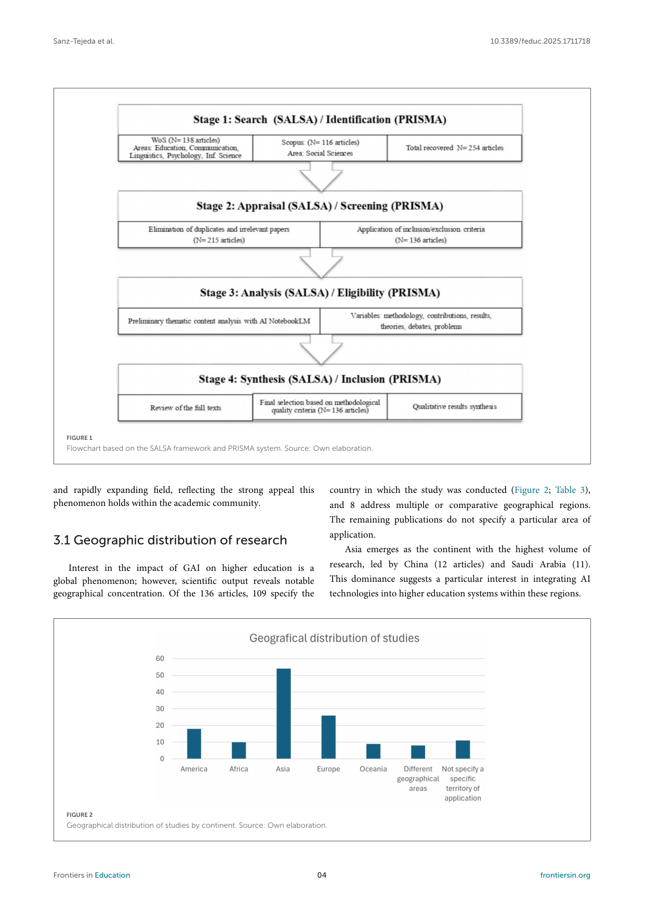
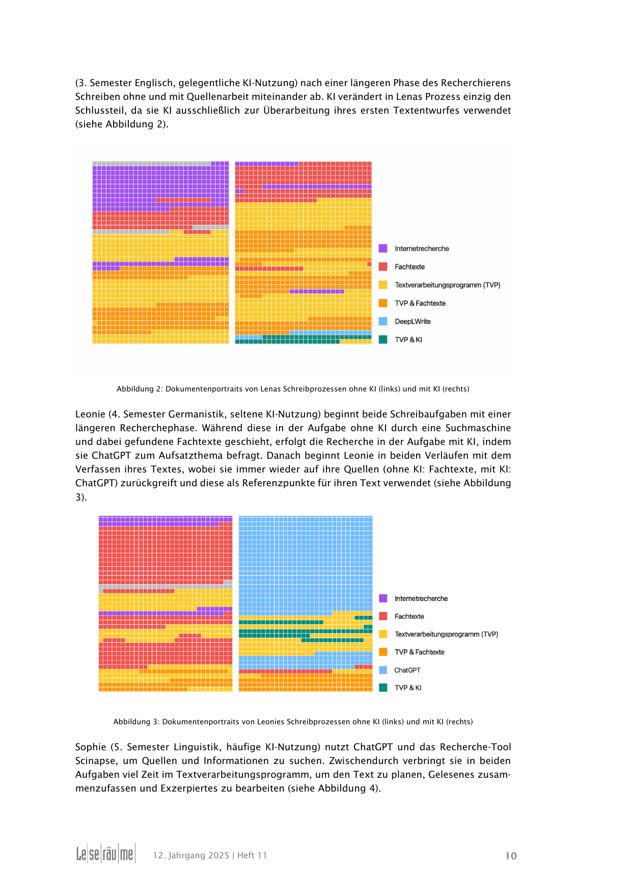
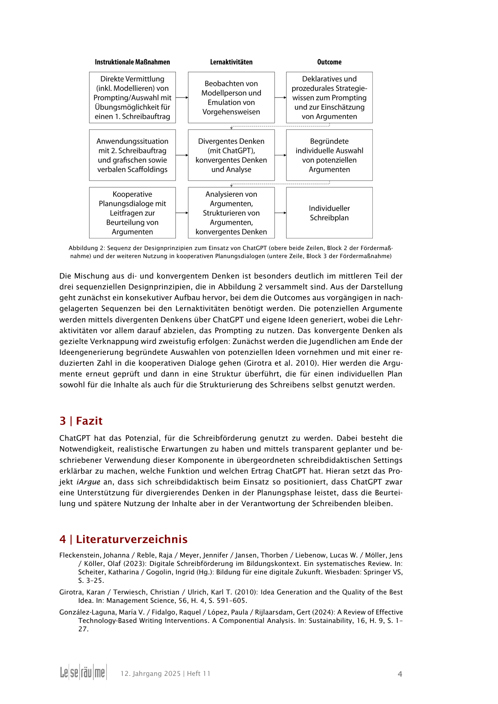
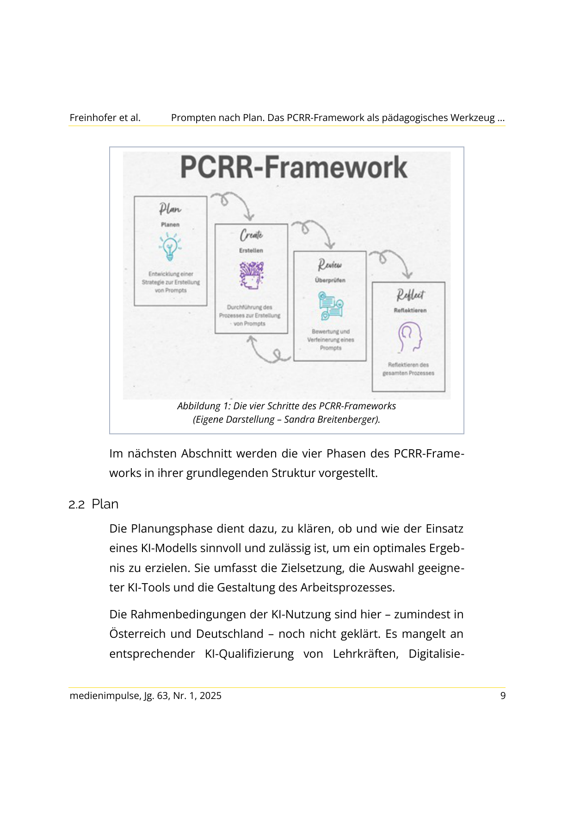
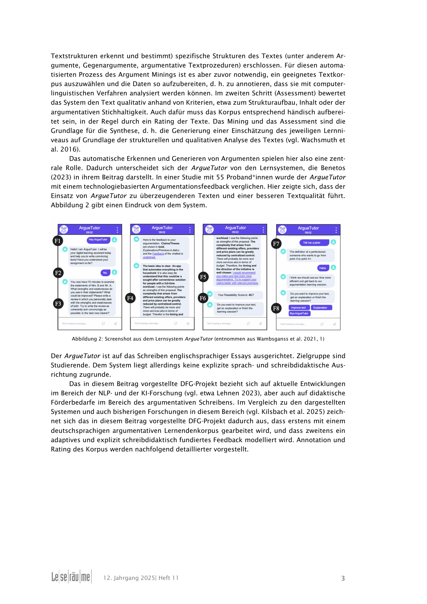
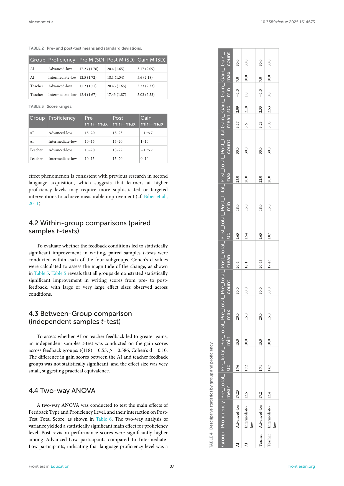

## {.artwork-slide background-color="#0a0a0f" visibility="uncounted"}

SYSTEM 1 · intuitiv, schnell

GEFAHR
WÄRME
HUNGER
HALT
JA
NEIN
ANGST
SCHÖN
FALSCH
SCHNELL
WAHR
LICHT
DURST
GRAU
WEH
HELL
KLIRR
WEG

SYSTEM 2 · deliberativ, langsam

Ich
überlege
mit
Absicht
▊

SYSTEM 3 · ausserhalb des Gehirns

ARTIFICIAL

COGNITION

<code>&lt;thinking/&gt;</code>

COGNITIVE SURRENDER

Wenn System 3 übernimmt.

Shaw &amp; Nave · Wharton · Januar 2026

N = 1 372 · 9 593 Trials · +25 / −15 %

Zwischen <em>Eigenarbeit</em> und <em>Übernahme</em>
— Schreibprozesse im Zeitalter generativer KI —

## Was Sie eben gesehen haben — und warum das Sorgen macht

<em>Konzept · Wortauswahl · Timing · Farbcode · CSS — die Animation stammt zu 100 % von Claude.</em>

Empirisch · KI-Kreativität

KI-Ideen machen Kurzgeschichten <strong>signifikant kreativer, besser geschrieben, unterhaltsamer</strong> — besonders bei weniger geübten Schreibenden (N = 293).

<a href="https://www.science.org/doi/10.1126/sciadv.adn5290" target="_blank">Doshi &amp; Hauser (2024)</a>, <em>Science Advances 10</em>(28).

Empirisch · Cognitive Surrender

Akkuratheit <strong>+25 pp</strong> bei korrekter KI · <strong>−15 pp</strong> bei fehlerhafter (N = 1 372). System 1 wird betäubt, System 2 umgangen, System 3 denkt ausserhalb.

<a href="https://papers.ssrn.com/sol3/papers.cfm?abstract_id=6097646" target="_blank">Shaw &amp; Nave (2026)</a>, SSRN · Wharton · Tri-System-Theorie.

Systematisches Review

136 Studien zu KI im Schreibprozess — wirkt, aber ausschliesslich bei didaktischer Einbettung.

<a href="https://doi.org/10.3389/feduc.2025.1711718" target="_blank">Sanz-Tejeda et al. (2026)</a>, <em>Frontiers in Education 10</em>, 1711718.

Individuell kreativer. 
Kollektiv einförmiger. 
Kognitiv kapitulierend.

Sanz-Tejeda et al. (2026) · PRISMA-Flussdiagramm &amp; geografische Verteilung

## Drei Fragen für die nächsten 25 Minuten

Die Studienlage ist klar — aber was heisst das für den Montag-Unterricht am ZAG? Drei Fragen führen durch den Rest dieses Inputs:

<ol style="margin-top: 1.2em; font-size: 1.05em; line-height: 1.65;">
<li><strong>Welche Forschungsevidenz 2025/26</strong> ist für den Schreibunterricht in Gesundheitsberufen handlungsleitend?</li>
<li><strong>Wie kombinieren</strong> erfahrene Lehrpersonen und Hochschuldozierende analoge und KI-gestützte Arbeit <strong>konkret</strong>?</li>
<li><strong>Welche drei Entscheidungen</strong> müssen Sie vor Montag treffen, damit der Einsatz didaktisch und rechtlich belastbar ist?</li>
</ol>

Erhebung im Plenum

Wer nutzt generative KI bereits in einer Schreibaufgabe mit Lernenden? <strong>Abstufung 0–3 per Handzeichen</strong> — damit ich sehe, auf welchem Stand Sie sind.

Auf diese drei Fragen kommen wir am Ende zurück.

## Vier Phasen, ein Prinzip

<h3 style="color: #7a00df; margin-top: 0; font-size: 1.15em;">1 · Planen</h3>

Ideen finden, Thema klären, Material sammeln

<h3 style="color: #7a00df; margin-top: 0; font-size: 1.15em;">2 · Strukturieren</h3>

Ordnen, Gliederung entwickeln

<h3 style="color: #e30059; margin-top: 0; font-size: 1.15em;">3 · Formulieren</h3>

Entwerfen, Sätze bauen

<h3 style="color: #e30059; margin-top: 0; font-size: 1.15em;">4 · Überarbeiten</h3>

Prüfen, überdenken, Feinschliff

Rekursive Rücksprünge zwischen allen Phasen · nach Hayes &amp; Flower (1980) · erweitert bei Kellogg (1996 ff.) · angewandt auf KI-Kontexte bei Schneegaß (2025)

Eigenständige Konzeptarbeit → KI-Input → begründete Entscheidung

<strong>Analog-first</strong> als Faustregel — gestützt durch zwei Befunde:

<ul style="margin-top: 0.5em;">
<li>Lernende nutzen KI am intensivsten beim <strong>Planen</strong>, kaum beim Überarbeiten — <a href="https://doi.org/10.1016/j.jslw.2025.101230" target="_blank">Hwang et al. (2025)</a></li>
<li>KI hebt Qualität, senkt aber Motivation und Autor:innenschaft — <a href="https://doi.org/10.1016/j.chbah.2025.100140" target="_blank">Mei et al. (2025)</a></li>
</ul>

Ausnahmen: Recherche bei fehlendem Vorwissen · standardisierte Textsorten · produktive Blockaden.

## Phase 1 · Planen — Blume · Mollick · Kentz

1 · Analog · <a href="https://bobblume.de/2025/01/05/unterricht-vorbereitung-fuer-die-klausur-parabelinterpretation/" target="_blank">nach Bob Blume</a>

Strukturiertes Vorwissen zuerst

Drei Schritte vor jeder KI: Problem identifizieren · Gliederung skizzieren · eigene Frage formulieren.

→

2 · KI · <a href="https://papers.ssrn.com/sol3/papers.cfm?abstract_id=4475995" target="_blank">nach Ethan Mollick</a>

KI als Tutor, nicht als Autor

"<em>Act as a tutor. Ask me 5 increasingly difficult questions. Do not give answers — only questions.</em>"

→

3 · Analog · <a href="https://mikekentz.substack.com/p/what-happened-when-we-taught-ai-literacy" target="_blank">nach Mike Kentz</a>

Chat-Transkript annotieren

rot übernommen · lila verworfen · blau eigener Gedanke.

<a href="https://xn--leserume-4za.de/wp-content/uploads/2025/06/Schneegass-2025-LR-JG12-H11.pdf" target="_blank">Schneegaß (2025)</a> · reale Schüler:innen-Schreibprozesse (grün = ChatGPT)

Empirisch · Sekundarstufe

Sek-Lernende nutzen ChatGPT <strong>am häufigsten beim Planen</strong>, kaum beim Überarbeiten.

<a href="https://doi.org/10.1002/jaal.1373" target="_blank">Levine et al. (2025)</a>, JAAL 68(5).

## Phase 2 · Strukturieren — UNC · Oxford · PHZH iArgue

1 · Analog · <a href="https://writingcenter.unc.edu/tips-and-tools/generative-ai-in-academic-writing/" target="_blank">nach UNC Writing Center</a>

Argumente händisch gewichten

Post-its mit allen Argumenten — <strong>vor</strong> KI-Konsultation markieren: stark · mittel · schwach.

→

2 · KI · <a href="https://www.ctl.ox.ac.uk/ai-tools-in-teaching" target="_blank">nach Oxford CTL</a>

Struktur-Varianten generieren

"<em>Outline this topic as (1) argumentative, (2) descriptive, (3) expository, (4) narrative essay. Compare how priority changes.</em>"

→

3 · Analog · <a href="https://xn--leserume-4za.de/wp-content/uploads/2025/06/Philipp-et-al-2025-LR-JG12-H11-1.pdf" target="_blank">nach Philipp et al., PHZH iArgue</a>

Divergent → konvergent

KI darf <strong>divergent</strong> sein — die <strong>konvergente</strong> Entscheidung verantwortet die Person schriftlich.

<a href="https://xn--leserume-4za.de/wp-content/uploads/2025/06/Philipp-et-al-2025-LR-JG12-H11-1.pdf" target="_blank">Philipp et al. (2025)</a> · iArgue-Designprinzipien (PHZH)

<strong>iArgue-Kernbefunde</strong> für argumentatives Schreiben:
<ul style="margin-top: 0.3em;">
<li><strong>Divergentes Denken</strong> gezielt durch KI erweitern</li>
<li><strong>Konvergentes Denken</strong> in der Textredaktion vom Menschen</li>
<li><strong>Metareflexion</strong> über KI-Output als Lernziel</li>
</ul>

Übertragbar auf Leserbrief, Stellungnahme, Fachberichte Pflege/Betreuung.

## Phase 3 · Formulieren — Wampfler · LSE · Roberts

1 · Analog · <a href="https://schulesocialmedia.com/2024/03/25/ki-als-spiegel/" target="_blank">nach Philippe Wampfler</a>

Freewriting zuerst

"<em>Erst wenn Sie wissen, was Sie sagen wollen, ist KI als Variationswerkzeug hilfreich.</em>"

→

2 · KI · <a href="https://blogs.lse.ac.uk/highereducation/2022/09/07/transforming-the-classroom-with-ai/" target="_blank">nach LSE (dokumentiert)</a>

Stil-Varianten + Reflexion

"<em>Suggest style improvements while keeping my argument. Then write a reflective paragraph comparing both versions.</em>"

→

3 · Analog · <a href="https://www.edutopia.org/article/ai-writing-feedback-students/" target="_blank">nach Jen Roberts</a>

3-Spalten-Urteil

<strong>Strengths</strong> · <strong>Areas of Growth</strong> · <strong>Wonderings</strong> — übernommen nur bei ≥ 2 Strengths.

<a href="https://doi.org/10.21243/mi-01-25-26" target="_blank">Freinhofer et al. (2025)</a> · PCRR-Framework (PH Tirol)

<strong>PCRR</strong>: Plan — Create — Review — Reflect.

Ein pädagogischer Prompting-Rahmen, iterativ in drei Praxisfällen erprobt. Statt "einfach prompten" eine bewusste Phasen-Struktur, die auch Lernenden vermittelbar ist.

"Prompt Literacy ist ein eigenständiges Lernziel, nicht bloss eine Technik." — <a href="https://doi.org/10.1002/jaal.70020" target="_blank">Tour &amp; Zadorozhnyy (2025)</a>

## Phase 4 · Überarbeiten — Haverkamp · Mollick · Kentz

1 · Peer · <a href="https://the-decoder.de/ein-lehrer-laesst-ki-bei-klassenarbeiten-zu-das-hat-er-dabei-gelernt/" target="_blank">nach Haverkamp</a>

Peer liest laut vor

"<em>Der Mund erkennt Brüche, die das Auge überliest.</em>" Stolperstellen rot markieren vor jeder KI-Nutzung.

→

2 · KI · <a href="https://papers.ssrn.com/sol3/papers.cfm?abstract_id=4475995" target="_blank">nach Mollick (Tutor-Rolle)</a>

Sokratische Fragen

"<em>Ask me 3 Socratic questions about my argument that I cannot easily answer. Do not correct — only question.</em>"

→

3 · Allein · <a href="https://mikekentz.substack.com/p/a-new-assessment-design-framework" target="_blank">nach Kentz</a>

Transkript-Annotation

Chat-Transkript wird nach Rubric bewertet. <em>Wo habe ich kapituliert?</em>

<a href="https://xn--leserume-4za.de/wp-content/uploads/2025/06/Rezat-et-al-2025-LR-JG12-H11.pdf" target="_blank">Rezat et al. (2025)</a> · ArguaTutor (DFG-Projekt Argue)

<a href="https://doi.org/10.3389/feduc.2025.1614673" target="_blank">Alnemrat et al. (2025)</a> · Pre/Post/Gain × AI vs. Lehrperson × Sprachniveau

## Prüfung &amp; Datenschutz — drei Montag-Entscheidungen

Prüfungsformat anpassen

Prompt-Protokoll als Leistungsbestandteil · mündliche Verteidigung nach Textabgabe · Gewichtung verschieben vom Produkt zum Prozess.

<a href="https://dlh.zh.ch/home/aktuell/708-leitfaeden-ki-projektarbeiten" target="_blank">DLH Kanton Zürich</a> · Falck &amp; Haverkamp (2025), <em>Pädagogik 77</em>(5).

Datenschutz · CH-DSG

Schüler:innentexte gehören <strong>nicht direkt in ChatGPT</strong>. Stattdessen: <a href="https://fobizz.com/de/ki-feedback/" target="_blank">fobizz</a>, <a href="https://www.zebis.ch/dossier/kuenstliche-intelligenz-und-chatgpt" target="_blank">SchulKI</a>, <a href="https://careum.ch/bereiche/verlag/news/ki-lerncoach-navira-ist-da" target="_blank">Careum Navira</a> — CH/EU-gehostete Oberflächen.

Minderjährigenschutz: erhöhte Anforderungen an Einwilligung und Zweckbindung.

Klassenregel explizit

KI-Einsatz <strong>pro Aufgabe</strong> spezifizieren (erlaubt / dokumentationspflichtig / untersagt). Lernende unterzeichnen die Klassenregel mit — Ownership entsteht durch Aushandlung.

Vorbild: <a href="https://www.lusem.lu.se/internal/support-and-resources/digital-tools/what-about-ai/" target="_blank">Lund University (LUSEM)</a> · Department-Policy mit Template.

Schweizer Berufsbildung

Die <a href="https://www.ict-berufsbildung.ch/projekte/digitalisierung/generative-ki-integration-in-der-berufsbildung" target="_blank">ICT-Berufsbildung Schweiz</a> dokumentiert seit 2025 Best-Practice-Beispiele für genau diese drei Entscheidungen — inklusive Textbausteinen für Reglemente und Prüfungsordnungen.

## Anwendungsphase · Fallarbeit

Paar- oder Dreier-Gruppen: Überarbeitung eines FaGe-Bewerbungstexts mit KI-Unterstützung

<strong>Ablauf (5 Minuten)</strong>
<ul style="margin-top: 0.4em; list-style: none; padding: 0;">
<li><strong>0:30</strong> Rezeption des Textes</li>
<li><strong>2:00</strong> Prompt formulieren und ausführen</li>
<li><strong>1:30</strong> Gruppenarbeit: Annehmen / Verwerfen mit Begründung</li>
<li><strong>1:00</strong> Plenum: eine zentrale Erkenntnis je Gruppe</li>
</ul>

Du bist meine kritische Leserin.  
Hier ist ein Text einer Lernenden für eine FaGe-Lehrstellenbewerbung: 
<strong>[TEXT EINFÜGEN]</strong>  
Gib mir: (1) drei Stellen, die <strong>nicht überzeugen</strong>. (2) eine Formulierungs-Alternative für den schwächsten Satz. (3) eine <strong>Frage</strong>, die ich der Lernenden stellen könnte.  
Bleibe konkret. <strong>Höchstens 120 Wörter.</strong> Korrigiere keine Fehler.

Schülertext "Mira Imhof" und Prompt-Vorlage auf dem Handout + QR-Code. 
<em>Der Text ist <strong>fiktiv</strong> — als realistisches Beispiel konstruiert, nicht von einer echten Lernenden.</em>

<strong style="color: #ff1744;">Wichtig für Montag:</strong> Echte Lernenden-Texte gehören nicht in ChatGPT. Nutzen Sie CH/EU-gehostete Oberflächen (fobizz, SchulKI, Careum Navira).

## Drei Antworten auf drei Fragen

Die drei Leitfragen vom Anfang — und was ich Ihnen darauf antworten kann.

1

Welche Forschungsevidenz ist handlungsleitend?

KI wirkt bei <strong>didaktischer Einbettung</strong> — aber mit messbarem Preis: "Individuell kreativer, kollektiv einförmiger, kognitiv kapitulierend."

2

Wie kombinieren Lehrpersonen konkret?

Immer im Muster <strong>analog → KI → analog</strong>. Die KI-Rolle wird bewusst gewählt: Tutor (Fragen) · Partner (Varianten) · niemals Ghostwriter.

3

Drei Entscheidungen vor Montag?

Prüfungsformat adaptieren (Prompt-Protokoll + mündliche Verteidigung) · Datenschutz wahren (CH/EU-gehostete Oberflächen) · Klassenregel mit Lernenden aushandeln.

"Prompt-Kompetenz ist ein Lernziel — keine Abkürzung."

## Materialien · Tools · Repo

<strong>Im Repo</strong> (QR →):
<ul style="margin-top: 0.4em; list-style: none; padding: 0;">
<li>📋 Cheat-Sheet A4 · 4 Phasen · 4 Workflows</li>
<li>✍️ Prompt-Sammlung · 12 getestete Prompts für ABU</li>
<li>📄 Schülertext Mira Imhof · Hands-on-PDF</li>
<li>📚 60 Literatur-Quellen 2025/26 · APA 7</li>
<li>🎨 Slides als HTML &amp; PDF</li>
</ul>

<strong style="color: #e30059;">Claude selbst ausprobieren</strong> 
<a href="https://claude.ai/download" target="_blank">claude.ai/download</a> · Desktop-App für Mac &amp; Windows · kostenfreier Tarif verfügbar.

github.com/ramonfueglister/picts_intensivwoche_2026

⬛⬜⬛ ⬜⬛⬜ ⬛⬜⬛

QR-Code zum Repo

## Literatur (Auswahl 2025/26, APA 7)

<a href="https://doi.org/10.3389/feduc.2025.1614673" target="_blank">Alnemrat, A.</a>, Aldamen, H., Almashour, M., Al-Deaibes, M., & AlSharefeen, R. (2025). AI vs. teacher feedback on EFL argumentative writing. *Frontiers in Education, 10*. https://doi.org/10.3389/feduc.2025.1614673

<a href="https://doi.org/10.21243/mi-01-25-26" target="_blank">Freinhofer, D.</a>, Schwabl, G., Aichinger, S., Breitenberger, S., Steindl, S., & Hechenberger, T. (2025). Prompten nach Plan: Das PCRR-Framework. *Medienimpulse, 63*(1). https://doi.org/10.21243/mi-01-25-26

<a href="https://doi.org/10.1016/j.jslw.2025.101230" target="_blank">Hwang, H.</a>, Chang, X., & Sun, J. (2025). Generative AI is useful for second language writing. *Journal of Second Language Writing, 69*, 101230. https://doi.org/10.1016/j.jslw.2025.101230

<a href="https://doi.org/10.1177/07356331251365187" target="_blank">Kızıltaş, Y.</a> (2025). Integration of AI into primary school students' writing skills. *Journal of Educational Computing Research*. https://doi.org/10.1177/07356331251365187

<a href="https://doi.org/10.1002/jaal.1373" target="_blank">Levine, S.</a>, Beck, S. W., Mah, C., Phalen, L., & Pittman, J. (2025). How do students use ChatGPT as a writing support? *Journal of Adolescent & Adult Literacy, 68*(5), 445–457. https://doi.org/10.1002/jaal.1373

<a href="https://doi.org/10.1016/j.chbah.2025.100140" target="_blank">Mei, P. et al.</a> (2025). Generative AI boosts performance but diminishes experience in creative writing. *Computers in Human Behavior: Artificial Humans, 4*, 100140. https://doi.org/10.1016/j.chbah.2025.100140

<a href="https://xn--leserume-4za.de/wp-content/uploads/2025/06/Philipp-et-al-2025-LR-JG12-H11-1.pdf" target="_blank">Philipp, M. et al.</a> (2025). Schreibinspiration vom Algorithmus. *Leseräume, 12*(11).

<a href="https://xn--leserume-4za.de/wp-content/uploads/2025/06/Rezat-et-al-2025-LR-JG12-H11.pdf" target="_blank">Rezat, S. et al.</a> (2025). Didaktische Modellierung automatisierten adaptiven Feedbacks. *Leseräume, 12*(11).

<a href="https://doi.org/10.3389/feduc.2025.1711718" target="_blank">Sanz-Tejeda, A. et al.</a> (2026). The impact of generative AI on academic reading and writing. *Frontiers in Education, 10*, 1711718. https://doi.org/10.3389/feduc.2025.1711718

<a href="https://xn--leserume-4za.de/wp-content/uploads/2025/06/Schneegass-2025-LR-JG12-H11.pdf" target="_blank">Schneegaß, R.</a> (2025). Schreibprozesse im Wandel. *Leseräume, 12*(11).

<a href="https://xn--leserume-4za.de/wp-content/uploads/2025/06/Steinhoff-Lehnen-2025-LR-JG12-H11.pdf" target="_blank">Steinhoff, T., & Lehnen, K.</a> (2025). Schreiben mit Künstlicher Intelligenz: Das GPT-Modell. *Leseräume, 12*(11).

<a href="https://doi.org/10.1002/jaal.70020" target="_blank">Tour, E., & Zadorozhnyy, A.</a> (2025). Conceptualizing and operationalizing prompt literacy. *Journal of Adolescent & Adult Literacy, 69*(3). https://doi.org/10.1002/jaal.70020

Wampfler, P. (2025). Literarisches Schreiben in der Schule — mit (und ohne?) KI. *Leseräume, 12*(11).

<a href="https://www.hachettebookgroup.com/titles/john-warner/more-than-words/9781541605510/" target="_blank">Warner, J.</a> (2025). *More than words: How to think about writing in the age of AI*. Basic Books.

<a href="https://doi.org/10.1080/17501229.2025.2503890" target="_blank">Zhang, Z.</a>, Aubrey, S., Huang, X., & Chiu, T. K. F. (2025). The role of generative AI and hybrid feedback in improving L2 writing skills. *Innovation in Language Learning and Teaching*. https://doi.org/10.1080/17501229.2025.2503890

45 weitere Quellen im Repo → docs/literature/2025-2026-KI-Schreibunterricht.md

## Diskussion

Vielen Dank für Ihre Aufmerksamkeit.

<strong>Ramon Füglister</strong> · ABU · ZAG Winterthur  
ramon.fuglister@zag.zh.ch · Repo: github.com/ramonfueglister/picts_intensivwoche_2026

