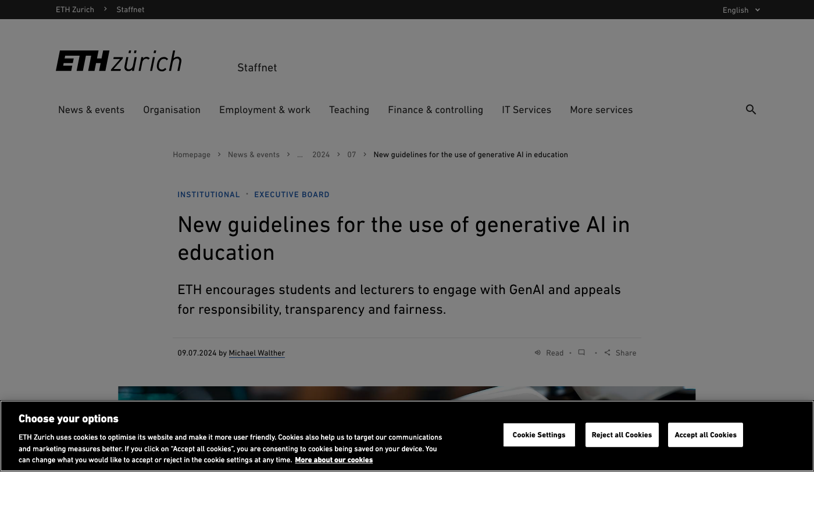
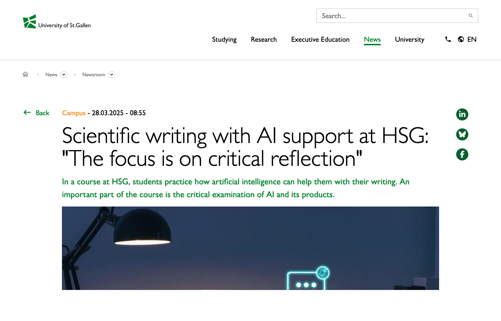
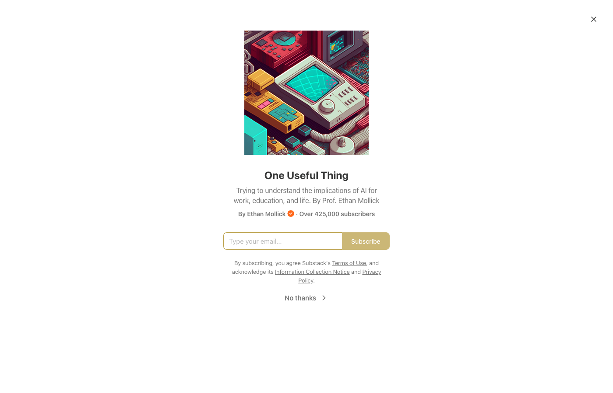
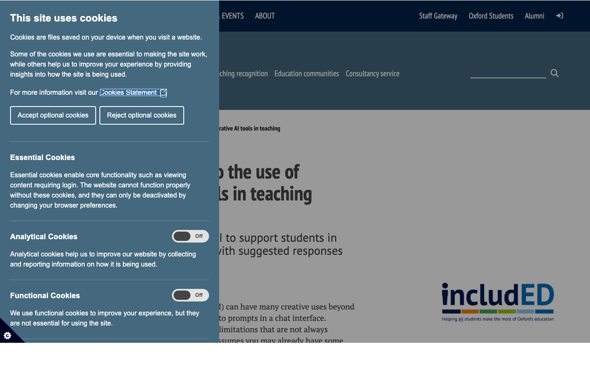
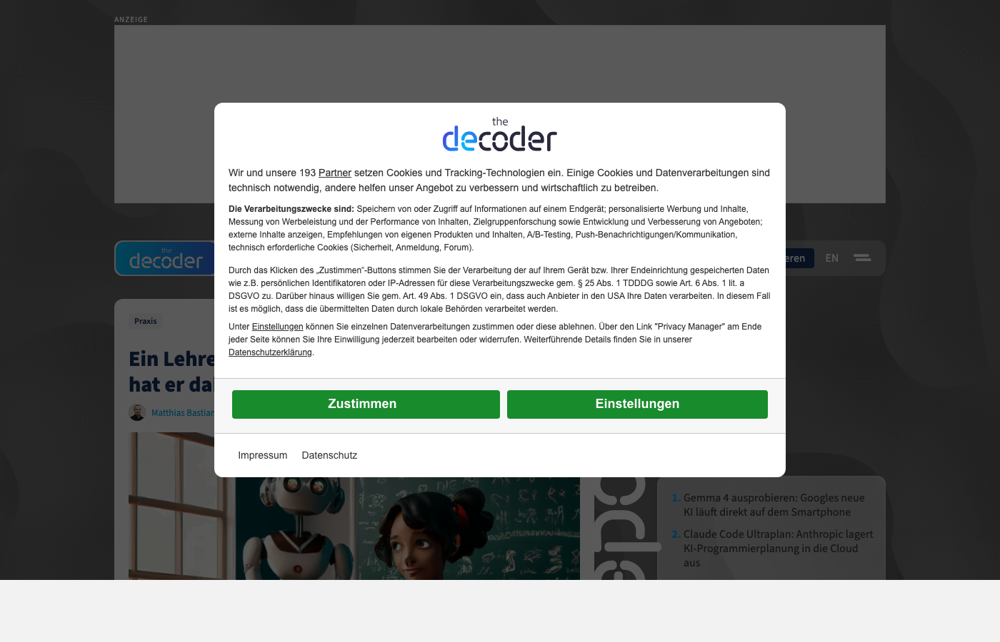
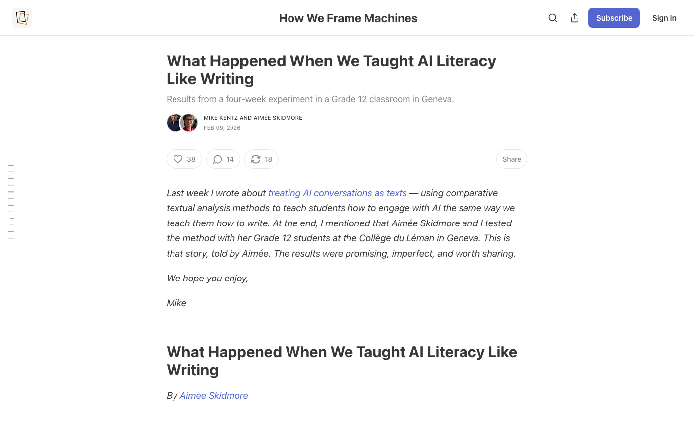
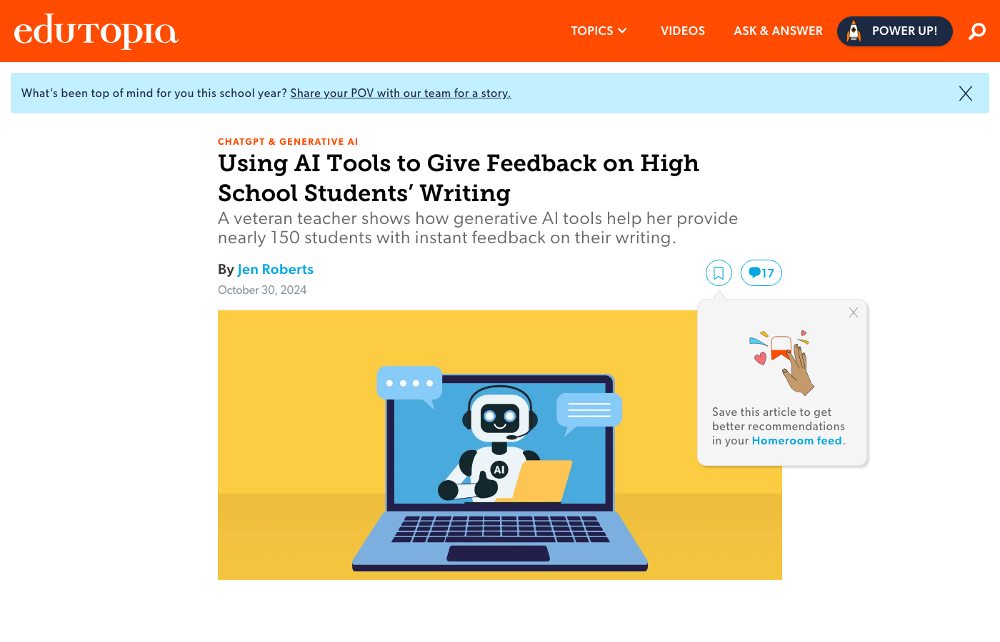
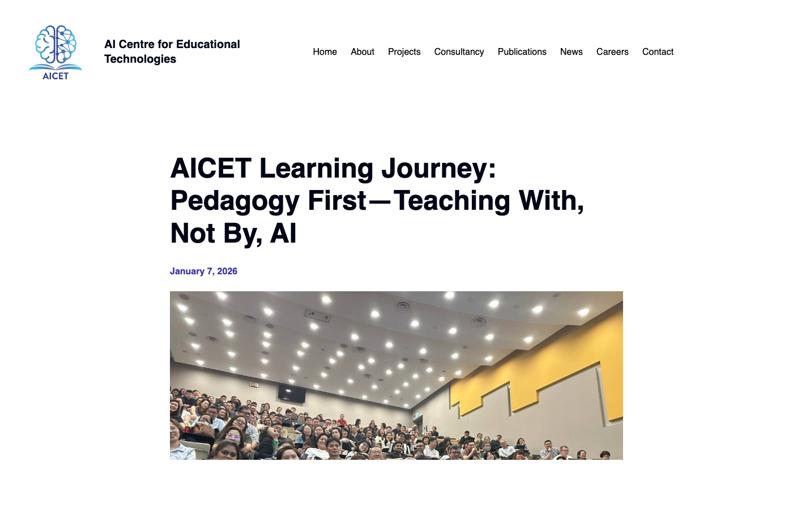
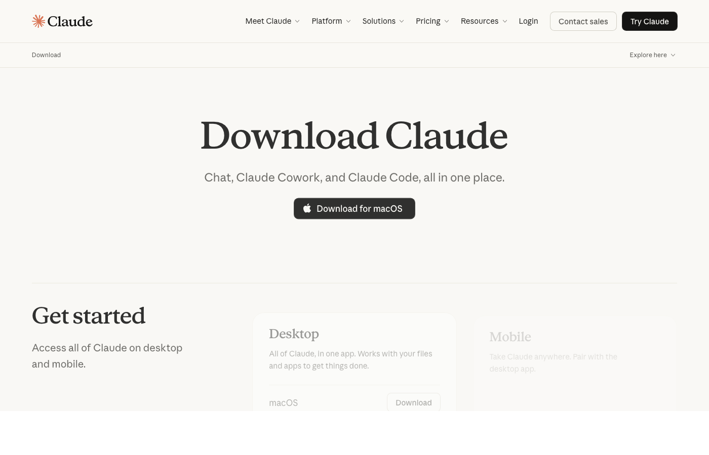

## {.artwork-slide background-color="#0a0a0f" visibility="uncounted"}

SYSTEM 1 · intuitiv, schnell

GEFAHR
WÄRME
HUNGER
HALT
JA
NEIN
ANGST
SCHÖN
FALSCH
SCHNELL
WAHR
LICHT
DURST
GRAU
WEH
HELL
KLIRR
WEG

SYSTEM 2 · deliberativ, langsam

Ich
überlege
mit
Absicht
▊

SYSTEM 3 · ausserhalb des Gehirns

ARTIFICIAL

COGNITION

<code>&lt;thinking/&gt;</code>

COGNITIVE SURRENDER

Wenn System 3 übernimmt.

Shaw &amp; Nave · Wharton · Januar 2026

N = 1 372 · 9 593 Trials · +25 / −15 %

Zwischen <em>Eigenarbeit</em> und <em>Übernahme</em>
— Schreibprozesse im Zeitalter generativer KI —

## Ausgangslage

Generative KI ist seit November 2022 flächig verfügbar. Drei Fragen strukturieren den Input:

<ol style="margin-top: 1em; font-size: 1em; line-height: 1.7;">
<li>Was sagt die empirische Forschung 2025/26 über den Einsatz generativer KI im Schreibprozess?</li>
<li>Welche didaktischen Konsequenzen ergeben sich für den Allgemeinbildenden Unterricht in Gesundheitsberufen?</li>
<li>Welche konkreten Arbeitsweisen lassen sich in die eigene Unterrichtspraxis übernehmen?</li>
</ol>

Erhebung im Plenum

Wer nutzt generative KI bereits in einer Schreibaufgabe mit Lernenden? Abstufung 0–3 per Handzeichen.

## Empirische Befundlage 2025/26

Systematisches Review · N = 136 Studien

Generative KI im Schreibprozess wirkt — jedoch ausschliesslich bei didaktischer Einbettung.

<a href="https://doi.org/10.3389/feduc.2025.1711718" target="_blank">Sanz-Tejeda et al. (2026)</a>, Frontiers in Education, 10, 1711718.

Experimentell · Primarschule

ChatGPT-Feedback steigert Kreativschreiben und Schreib-Selbstwirksamkeit signifikant (d = 0.92).

<a href="https://doi.org/10.1177/07356331251365187" target="_blank">Kızıltaş (2025)</a>, Journal of Educational Computing Research.

RCT · EFL-Studierende

KI-Feedback ist Lehrerfeedback statistisch äquivalent; schwächere Lernende profitieren stärker.

<a href="https://doi.org/10.3389/feduc.2025.1614673" target="_blank">Alnemrat et al. (2025)</a>, Frontiers in Education, 10, 1614673.

Qualitatives Experiment

KI erhöht die Output-Qualität, senkt aber die intrinsische Motivation.

<a href="https://doi.org/10.1016/j.chbah.2025.100140" target="_blank">Mei et al. (2025)</a>, Computers in Human Behavior: Artificial Humans, 4, 100140.

Methodenkritik

Viele KI-Effektstudien bleiben unterspezifiziert — "an effect in search of a cause".

<a href="https://doi.org/10.1111/jcal.70105" target="_blank">Weidlich et al. (2025)</a>, JCAL, 41(5), e70105.

Tri-System-Theorie · Kognitive Kapitulation

N = 1 372 · 9 593 Trials: Akkuratheit steigt +25 pp bei korrekter KI, fällt −15 pp bei fehlerhafter — am stärksten bei tiefem <em>need for cognition</em>.

<a href="https://papers.ssrn.com/sol3/papers.cfm?abstract_id=6097646" target="_blank">Shaw &amp; Nave (2026)</a>, SSRN 6097646 · Wharton Research Paper.

<a href="https://doi.org/10.3389/feduc.2025.1711718" target="_blank">Sanz-Tejeda et al. (2026)</a> — PRISMA-Flussdiagramm der Studienauswahl und geografische Verteilung der 136 Studien.

## Theoretischer Rahmen: Schreibprozess als rekursives Modell

<h3 style="color: #7a00df; margin-top: 0;">1 · Planen</h3>

Ideen finden, Thema klären, Material sammeln

<h3 style="color: #7a00df; margin-top: 0;">2 · Strukturieren</h3>

Ordnen, Gliederung entwickeln

<h3 style="color: #e30059; margin-top: 0;">3 · Formulieren</h3>

Entwerfen, Sätze bauen

<h3 style="color: #e30059; margin-top: 0;">4 · Überarbeiten</h3>

Prüfen, überdenken, Feinschliff

Rekursive Rücksprünge zwischen allen Phasen (Hayes & Flower, 1980; Kellogg, 1996 ff.)

## Didaktisches Prinzip: Analoge Vorarbeit zuerst

Eigenständige Konzeptarbeit → KI-Input → begründete Entscheidung

Empirisch — Wann KI?

Empirisch konzentriert sich die KI-Nutzung auf frühe Prozess­phasen — insbesondere die Ideenfindung.

<a href="https://doi.org/10.1016/j.jslw.2025.101230" target="_blank">Hwang et al. (2025)</a>, Journal of Second Language Writing.

Empirisch — Warum vorsichtig?

KI-Einsatz erhöht die Output-Qualität, reduziert jedoch die intrinsische Motivation und das Erleben von Autor:innenschaft.

<a href="https://doi.org/10.1016/j.chbah.2025.100140" target="_blank">Mei et al. (2025)</a>, Computers in Human Behavior: Artificial Humans.

<strong>Ausnahmefälle:</strong> Recherche bei fehlendem Vorwissen · standardisierte Textsorten (Protokoll, Checkliste) · Überwindung produktiver Blockaden.

## Dokumentierte Unterrichtspraxis — Internationale Fallauswahl

<a class="globe-tile-link" href="https://ethz.ch/staffnet/en/news-and-events/internal-news/archive/2024/07/new-guidelines-for-the-use-of-generative-ai-in-education.html" target="_blank">

🇨🇭ETH Zürich

Universität · 2024

Obligatorische "Statement on Usage of AI" in BA/MA-Thesen — wer welches Tool wofür.

</a>

<a class="globe-tile-link" href="https://www.unisg.ch/en/newsdetail/news/scientific-writing-with-ai-support-at-hsg-the-focus-is-on-critical-reflection/" target="_blank">

🇨🇭HSG Writing Lab

St. Gallen · 2025

Kurs "Scientific writing with AI support" · 700 Beratungen, 1/5 zu KI.

</a>

<a class="globe-tile-link" href="https://www.oneusefulthing.org/" target="_blank">

🇺🇸Ethan Mollick

Wharton · Newsletter

"Assigning AI" — 7 konkrete KI-Rollen im Schreibunterricht mit Prompts.

</a>

<a class="globe-tile-link" href="https://www.ctl.ox.ac.uk/ai-tools-in-teaching" target="_blank">

🇬🇧Oxford CTL

Universität

"Compare: Thema als Essay vs. Abstract vs. Poster" — KI generiert, Studierende werten.

</a>

<a class="globe-tile-link" href="https://the-decoder.de/ein-lehrer-laesst-ki-bei-klassenarbeiten-zu-das-hat-er-dabei-gelernt/" target="_blank">

🇩🇪Hendrik Haverkamp

Gymnasium Gütersloh

Klausuren <strong>mit</strong> ChatGPT erlaubt; KI-Passagen markiert wie Zitate.

</a>

<a class="globe-tile-link" href="https://mikekentz.substack.com/p/a-new-assessment-design-framework" target="_blank">

🇺🇸Mike Kentz

HS Savannah, GA · 2025

"Stop grading essays. Start grading chat transcripts." — Chat als bewertbares Artefakt.

</a>

<a class="globe-tile-link" href="https://www.edutopia.org/article/ai-writing-feedback-students/" target="_blank">

🇺🇸Jen Roberts

San Diego HS · 9. Klasse

KI-Feedback in 3 Spalten: <em>Strengths · Growth · Wonderings</em> — Klasse kritisiert gemeinsam.

</a>

<a class="globe-tile-link" href="https://aicet.comp.nus.edu.sg/aicet-learning-journey-pedagogy-first-teaching-with-not-by-ai/" target="_blank">

🇸🇬NUS AICET

Singapur · 2025/26

"GuIDES"-Modell · KI als fehlbares Werkzeug in qualitativer Forschung einüben.

</a>

Ergänzende 30 Fälle in der Praxis-Datenbank des Repositoriums (Sydney · HKU · Tec de Monterrey · Lund · Manuel Flick · Holly Clark · NOLAI/NL · MEXT Japan · BMBWF Österreich · National Literacy Trust UK · Victoria Academy AUS · UNC Writing Center · TU Dresden · PH Freiburg · LSE · u. a.)

## Phase 1: Planen — wie echte Lehrpersonen es machen

1 · Analog · <a href="https://bobblume.de/2025/01/05/unterricht-vorbereitung-fuer-die-klausur-parabelinterpretation/" target="_blank">nach Bob Blume, Gym BW</a>

Strukturiertes Vorwissen zuerst

Lernende durchlaufen drei Schritte <strong>bevor</strong> sie KI öffnen: Problem eigenständig identifizieren · Gliederung skizzieren · eine Frage an sich selbst formulieren.

→

2 · KI · <a href="https://papers.ssrn.com/sol3/papers.cfm?abstract_id=4475995" target="_blank">nach Ethan Mollick, Wharton</a>

KI als Tutor, nicht als Autor

"<em>Act as a tutor for [Thema]. Ask me 5 increasingly difficult questions that test my understanding. Do not give answers — only questions.</em>" <small>aus "Assigning AI: Seven Approaches for Students" (SSRN 4475995).</small>

→

3 · Analog · <a href="https://mikekentz.substack.com/p/what-happened-when-we-taught-ai-literacy" target="_blank">nach Mike Kentz, Savannah</a>

Chat-Transkript als Artefakt

Lernende annotieren den gesamten Prompt-Verlauf: rot = übernommen · lila = verworfen · blau = eigener Gedanke nach KI.

Prinzip "Partner" nach <a href="https://xn--leserume-4za.de/wp-content/uploads/2025/06/Steinhoff-Lehnen-2025-LR-JG12-H11.pdf" target="_blank">Steinhoff & Lehnen (2025)</a> — KI als Sparringspartner, nicht als Ghostwriter.

## Phase 1: Empirische Befunde zur realen KI-Nutzung

<a href="https://xn--leserume-4za.de/wp-content/uploads/2025/06/Schneegass-2025-LR-JG12-H11.pdf" target="_blank">Schneegaß (2025)</a>, Leseräume 12(11) — Dokumentenportraits realer Schüler:innen-Schreibprozesse (grün = ChatGPT-Nutzung)

Qualitative Studie · Sekundarstufe

"Sekundar-Lernende nutzen ChatGPT in der Planungs­phase <strong>am häufigsten</strong> — aber selten für die Überarbeitung."

<a href="https://doi.org/10.1002/jaal.1373" target="_blank">Levine et al. (2025)</a>, Journal of Adolescent & Adult Literacy.

Didaktische Implikation für FaGe-/FaBe-Unterricht: Die Planungsphase ist der natürliche Einstiegspunkt für einen strukturierten KI-Einsatz.

## Phase 2: Strukturieren — wie echte Lehrpersonen es machen

1 · Analog · <a href="https://writingcenter.unc.edu/tips-and-tools/generative-ai-in-academic-writing/" target="_blank">nach UNC Writing Center</a>

Argumente händisch gewichten

UNC-Richtlinie: Studierende legen alle Argumente auf Post-its und markieren <strong>vor jeder KI-Konsultation</strong>: stark · mittel · schwach. Nur so wird KI-Feedback adressierbar.

→

2 · KI · <a href="https://www.ctl.ox.ac.uk/ai-tools-in-teaching" target="_blank">nach Oxford CTL</a>

Struktur-Varianten generieren

"<em>Outline this topic as (1) argumentative, (2) descriptive, (3) expository, (4) narrative essay. Compare how content priority changes.</em>" <small>Oxford CTL: "Essays ändern Struktur je nach Zweck — KI macht das sichtbar."</small>

→

3 · Analog · <a href="https://xn--leserume-4za.de/wp-content/uploads/2025/06/Philipp-et-al-2025-LR-JG12-H11-1.pdf" target="_blank">nach Philipp et al., PHZH iArgue</a>

Divergent → konvergent

KI darf <strong>divergent</strong> sein (Varianten aufmachen). Die <strong>konvergente</strong> Entscheidung — welche Struktur, warum — verantwortet die Person schriftlich.

Entscheidung bleibt beim Menschen. KI gibt <strong>Optionen</strong>, nicht Antworten.

## Phase 2: Forschungsprojekt iArgue (PHZH)

<a href="https://xn--leserume-4za.de/wp-content/uploads/2025/06/Philipp-et-al-2025-LR-JG12-H11-1.pdf" target="_blank">Philipp et al. (2025)</a>, Leseräume 12(11) — iArgue-Designprinzipien

<strong>Schreibdidaktische Designprinzipien für argumentatives Schreiben mit ChatGPT</strong> (Sek II):

<ul style="margin-top: 0.3em;">
<li><strong>Divergentes Denken</strong> gezielt durch KI erweitern (offene Prompts)</li>
<li><strong>Konvergentes Denken</strong> in der Textredaktion vom Menschen durchführen</li>
<li><strong>Metareflexion</strong> über KI-Output explizit zum Lernziel machen</li>
</ul>

Transfer in den ABU-/BMS-Unterricht: übertragbar auf Leserbrief, Stellungnahme und argumentativ-begründende Fachberichte in Pflege und Betreuung.

"Ghost / Partner / Tutor — KI-Rolle bewusst wählen." — <a href="https://xn--leserume-4za.de/wp-content/uploads/2025/06/Steinhoff-Lehnen-2025-LR-JG12-H11.pdf" target="_blank">Steinhoff & Lehnen (2025)</a>

## Phase 3: Formulieren — wie echte Lehrpersonen es machen

1 · Analog · <a href="https://schulesocialmedia.com/2024/03/25/ki-als-spiegel/" target="_blank">nach Philippe Wampfler, UZH / KS Enge</a>

Freewriting zuerst

Wampfler in "KI als Spiegel": <em>"Erst wenn Sie wissen, was Sie sagen wollen, ist KI als Variationswerkzeug hilfreich."</em> 5 Minuten Hand &amp; Papier, ohne Korrektur.

→

2 · KI · <a href="https://blogs.lse.ac.uk/highereducation/2022/09/07/transforming-the-classroom-with-ai/" target="_blank">nach LSE (dokumentiert)</a>

Stil-Varianten + Reflexion

"<em>Here is my paragraph: [text]. Suggest improvements to style while keeping my argument. Then write a reflective paragraph comparing both versions.</em>" <small>LSE: besonders wertvoll für L2-/DaZ-Schreibende.</small>

→

3 · Analog · <a href="https://www.edutopia.org/article/ai-writing-feedback-students/" target="_blank">nach Jen Roberts, Point Loma HS</a>

3-Spalten-Urteil

Roberts' Klasse bewertet jeden KI-Vorschlag in drei Spalten: <strong>Strengths</strong> · <strong>Areas of Growth</strong> · <strong>Wonderings</strong>. Übernommen nur, was mindestens zwei Strengths hat.

Weitere Prompt-Muster: "Aktiv statt passiv." · "Konkret statt abstrakt." · "B2-Niveau halten." · "Schweizer Hochdeutsch."

## Phase 3: PCRR-Framework (PH Tirol)

<a href="https://doi.org/10.21243/mi-01-25-26" target="_blank">Freinhofer et al. (2025)</a>, Medienimpulse 63(1) — PCRR-Framework © Sandra Breitenberger

<strong>Plan — Create — Review — Reflect</strong>

Ein <strong>pädagogischer Prompting-Rahmen</strong> aus der PH Tirol. Iterativ entwickelt im universitären Lehrbetrieb, in drei Praxisfällen getestet.

Für den ABU-Unterricht ermöglicht die Phasenstruktur eine reflektierte Prompt-Arbeit, die auch Lernenden vermittelt werden kann.

"Prompt Literacy ist ein eigenes Lernziel, nicht bloss eine Technik."

<a href="https://doi.org/10.1002/jaal.70020" target="_blank">Tour & Zadorozhnyy (2025)</a>, JAAL.

## Phase 4: Überarbeiten — wie echte Lehrpersonen es machen

1 · Peer · <a href="https://the-decoder.de/ein-lehrer-laesst-ki-bei-klassenarbeiten-zu-das-hat-er-dabei-gelernt/" target="_blank">nach Haverkamp, Gütersloh</a>

Peer liest laut vor

Haverkamp lässt Paare <strong>vor jeder KI-Nutzung</strong> gegenseitig vorlesen. Stolperstellen werden händisch rot markiert. "Der Mund erkennt Brüche, die das Auge überliest."

→

2 · KI · <a href="https://papers.ssrn.com/sol3/papers.cfm?abstract_id=4475995" target="_blank">nach Mollick (Tutor-Rolle)</a>

Sokratische Fragen statt Korrektur

"<em>You are my tutor. Ask me 3 Socratic questions about my argument that I cannot easily answer. Do not correct, do not add — only question.</em>" <small>Mollick: bewusster Wechsel vom "Helper" zum "Challenger".</small>

→

3 · Allein · <a href="https://mikekentz.substack.com/p/a-new-assessment-design-framework" target="_blank">nach Mike Kentz, Savannah</a>

Transkript-Annotation

Kentz bewertet <strong>Chat-Transkripte statt Essays</strong>: Hat die KI echte Brüche markiert? Welche Antworten waren flach? <em>Wo habe ich kapituliert?</em>

"Hybrides Feedback (KI + Mensch) übertrifft beide einzeln." — <a href="https://doi.org/10.1080/17501229.2025.2503890" target="_blank">Zhang et al. (2025)</a>

## Phase 4: Adaptives KI-Feedback — ArguaTutor

<a href="https://xn--leserume-4za.de/wp-content/uploads/2025/06/Rezat-et-al-2025-LR-JG12-H11.pdf" target="_blank">Rezat et al. (2025)</a> — ArguaTutor im DFG-Projekt Argue

<a href="https://doi.org/10.3389/feduc.2025.1614673" target="_blank">Alnemrat et al. (2025)</a> — Pre/Post/Gain × AI vs. Lehrperson × Sprachniveau

<strong>ArguaTutor:</strong> automatisierte Identifikation argumentativer Strukturen · Rating der Schreibqualität · adaptives Feedback auf Basis schreibdidaktischer Fördermassnahmen.

Der Tutor operiert nicht korrigierend, sondern fragend.

Der Ansatz ist auf Pflegedokumentation, Praktikumsberichte und reflektierende Texte übertragbar.

## Anwendungsphase · Fallarbeit

Paar- oder Dreier-Gruppen: Überarbeitung eines FaGe-Bewerbungstexts mit KI-Unterstützung

<strong>Ablauf (5 Minuten)</strong>
<ul style="margin-top: 0.4em; list-style: none; padding: 0;">
<li><strong>0:30</strong> Rezeption des Textes</li>
<li><strong>2:00</strong> Prompt formulieren und ausführen</li>
<li><strong>1:30</strong> Gruppenarbeit: Annehmen / Verwerfen mit Begründung</li>
<li><strong>1:00</strong> Plenum: eine zentrale Erkenntnis je Gruppe</li>
</ul>

Du bist meine kritische Leserin.  
Hier ist ein Text einer Lernenden für eine FaGe-Lehrstellenbewerbung: 
<strong>[TEXT EINFÜGEN]</strong>  
Gib mir: (1) drei Stellen, die <strong>nicht überzeugen</strong>. (2) eine Formulierungs-Alternative für den schwächsten Satz. (3) eine <strong>Frage</strong>, die ich der Lernenden stellen könnte.  
Bleibe konkret. <strong>Höchstens 120 Wörter.</strong> Korrigiere keine Fehler.

Schülertext "Mira Imhof" und Prompt-Vorlage auf dem Handout + QR-Code.

## Synthese — drei didaktische Leitsätze

<ol class="takeaway-list">
<li>Generative KI ersetzt keine Schreibphase. Sie verändert, wie Schreibphasen gestaltet werden.</li>
<li>Analoge und digitale Verfahren bilden keine Addition, sondern eine Komposition — mit phasenspezifischen Entscheidungen.</li>
<li>Prompt-Kompetenz ist ein eigenständiges Lernziel und muss als solches explizit vermittelt werden.</li>
</ol>

## Weiterführende Materialien

<strong>Begleitmaterialien im Repositorium:</strong>
<ul style="margin-top: 0.4em; list-style: none; padding: 0;">
<li>📋 <strong>Cheat-Sheet A4</strong> — 4 Phasen · 4 Workflows · Ghost/Partner/Tutor</li>
<li>✍️ <strong>Prompt-Sammlung</strong> — 12 getestete Prompts für ABU</li>
<li>📄 <strong>Schülertext "Mira Imhof"</strong> — PDF für Hands-on</li>
<li>📚 <strong>60 Literatur-Quellen</strong> (2025/26, APA 7)</li>
<li>🎨 <strong>Slides</strong> als HTML & PDF</li>
</ul>

github.com/ramonfueglister/picts_intensivwoche_2026

⬛⬜⬛ ⬜⬛⬜ ⬛⬜⬛

QR-Code zum Repo

## Wo Sie Claude selbst ausprobieren

<a href="https://claude.ai/download" target="_blank">claude.ai/download</a> · Stand 2026-04-16

<strong>Claude Desktop App</strong> · macOS und Windows · kostenfreier Tarif verfügbar.

<ul style="margin-top: 0.5em;">
<li>Zugriff per Tastaturkurzbefehl aus jedem Programm (Alt+Space auf Mac)</li>
<li>Datei-Upload direkt aus dem Finder</li>
<li>Projekt-Kontext bleibt zwischen Sitzungen erhalten</li>
<li>Integration mit E-Mail, Kalender, Drive für schulische Nutzung optional</li>
</ul>

Hinweis

Dieser Input entstand in wenigen Stunden in Co-Produktion mit Claude. Die Einstiegs­animation hat Claude selbst gestaltet.

## Literatur (Auswahl 2025/26, APA 7)

<a href="https://doi.org/10.3389/feduc.2025.1614673" target="_blank">Alnemrat, A.</a>, Aldamen, H., Almashour, M., Al-Deaibes, M., & AlSharefeen, R. (2025). AI vs. teacher feedback on EFL argumentative writing. *Frontiers in Education, 10*. https://doi.org/10.3389/feduc.2025.1614673

<a href="https://doi.org/10.21243/mi-01-25-26" target="_blank">Freinhofer, D.</a>, Schwabl, G., Aichinger, S., Breitenberger, S., Steindl, S., & Hechenberger, T. (2025). Prompten nach Plan: Das PCRR-Framework. *Medienimpulse, 63*(1). https://doi.org/10.21243/mi-01-25-26

<a href="https://doi.org/10.1016/j.jslw.2025.101230" target="_blank">Hwang, H.</a>, Chang, X., & Sun, J. (2025). Generative AI is useful for second language writing. *Journal of Second Language Writing, 69*, 101230. https://doi.org/10.1016/j.jslw.2025.101230

<a href="https://doi.org/10.1177/07356331251365187" target="_blank">Kızıltaş, Y.</a> (2025). Integration of AI into primary school students' writing skills. *Journal of Educational Computing Research*. https://doi.org/10.1177/07356331251365187

<a href="https://doi.org/10.1002/jaal.1373" target="_blank">Levine, S.</a>, Beck, S. W., Mah, C., Phalen, L., & Pittman, J. (2025). How do students use ChatGPT as a writing support? *Journal of Adolescent & Adult Literacy, 68*(5), 445–457. https://doi.org/10.1002/jaal.1373

<a href="https://doi.org/10.1016/j.chbah.2025.100140" target="_blank">Mei, P. et al.</a> (2025). Generative AI boosts performance but diminishes experience in creative writing. *Computers in Human Behavior: Artificial Humans, 4*, 100140. https://doi.org/10.1016/j.chbah.2025.100140

<a href="https://xn--leserume-4za.de/wp-content/uploads/2025/06/Philipp-et-al-2025-LR-JG12-H11-1.pdf" target="_blank">Philipp, M. et al.</a> (2025). Schreibinspiration vom Algorithmus. *Leseräume, 12*(11).

<a href="https://xn--leserume-4za.de/wp-content/uploads/2025/06/Rezat-et-al-2025-LR-JG12-H11.pdf" target="_blank">Rezat, S. et al.</a> (2025). Didaktische Modellierung automatisierten adaptiven Feedbacks. *Leseräume, 12*(11).

<a href="https://doi.org/10.3389/feduc.2025.1711718" target="_blank">Sanz-Tejeda, A. et al.</a> (2026). The impact of generative AI on academic reading and writing. *Frontiers in Education, 10*, 1711718. https://doi.org/10.3389/feduc.2025.1711718

<a href="https://xn--leserume-4za.de/wp-content/uploads/2025/06/Schneegass-2025-LR-JG12-H11.pdf" target="_blank">Schneegaß, R.</a> (2025). Schreibprozesse im Wandel. *Leseräume, 12*(11).

<a href="https://xn--leserume-4za.de/wp-content/uploads/2025/06/Steinhoff-Lehnen-2025-LR-JG12-H11.pdf" target="_blank">Steinhoff, T., & Lehnen, K.</a> (2025). Schreiben mit Künstlicher Intelligenz: Das GPT-Modell. *Leseräume, 12*(11).

<a href="https://doi.org/10.1002/jaal.70020" target="_blank">Tour, E., & Zadorozhnyy, A.</a> (2025). Conceptualizing and operationalizing prompt literacy. *Journal of Adolescent & Adult Literacy, 69*(3). https://doi.org/10.1002/jaal.70020

Wampfler, P. (2025). Literarisches Schreiben in der Schule — mit (und ohne?) KI. *Leseräume, 12*(11).

<a href="https://www.hachettebookgroup.com/titles/john-warner/more-than-words/9781541605510/" target="_blank">Warner, J.</a> (2025). *More than words: How to think about writing in the age of AI*. Basic Books.

<a href="https://doi.org/10.1080/17501229.2025.2503890" target="_blank">Zhang, Z.</a>, Aubrey, S., Huang, X., & Chiu, T. K. F. (2025). The role of generative AI and hybrid feedback in improving L2 writing skills. *Innovation in Language Learning and Teaching*. https://doi.org/10.1080/17501229.2025.2503890

45 weitere Quellen im Repo → docs/literature/2025-2026-KI-Schreibunterricht.md

## Diskussion

Vielen Dank für Ihre Aufmerksamkeit.

<strong>Ramon Füglister</strong> · ABU · ZAG Winterthur  
ramon.fuglister@zag.zh.ch · Repo: github.com/ramonfueglister/picts_intensivwoche_2026

